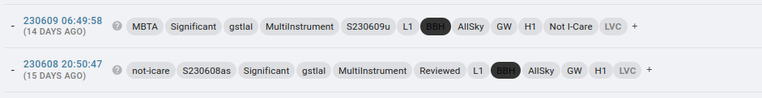
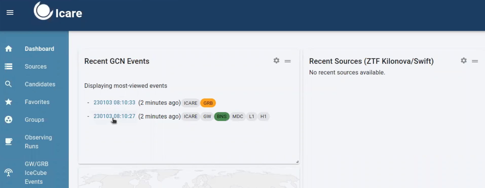

## Checking Alerts

In this campaign, **we will follow GW alerts.** As Sarah's mention in
her video, there will be different classification of GW (preliminary,
early, initial and updated).

As soon as LVK detect an [event A PRELIMINARY alert] will be
shown **in #gwalerts slack channel and #skyportal-alerts**, which has an
skymap associated to it. Having a skymap related to the GW alert means
that our telescopes can starting observing within the sky area.

So here, as an FA, you should notify the telescopes about the event and
ask for observations (check Sarah's video in order to understand if the
preliminary should be or not followed).

In the **#gwalerts slack channel and #skyportal-alerts**, there is a
message for you as an FA to help you in case of doubts.

Nota bene: in O4, we only deal with "significant" alerts in O4. Which
means that the FAR should be at least 12 per year (and the significant
be at == 1).

In Sarah's video you can understand better what is the PRELIMINARY GW
ALERT, how it looks like in **#gwalerts slack channel and
#skyportal-alerts**, and which ones are the best to be followed by
GRANDMA:
[https://www.youtube.com/watch?v=b0HGRygGzrE](https://www.youtube.com/watch?v=b0HGRygGzrE)

In summary, **our focus are GW alerts coming from BNS and BHNS,
relatively near - below 200 Mpc, area below 200 deg\^2, and GRANDMA
score 2, 3 or 4. If all these requirements are met, you can ask for
follow-up observation in this phase (as soon as you received the first
GW alert/PRELIMINARY).** If not, wait for the UPDATED classification of
the same GW alert. **If the source does not satisfy these
specifications, you can remove the tag GO GRANDMA and add the tag
"not-Icare" by adding "+".**

**We do not take into account if HasRemnant is 1 or 0.**

**Moreover, if you have started observations, when all the observations
are finished, remove the GO GRANDMA tag and add "STOP GRANDMA" with the
+**

**In both cases, the name of the event should be added as "S230609u", it
isn't automatic.**

If the GW is marked as INITIAL classification, it will give you the
information whether or not the GW alert is from astrophysical origin
(here also there is a skymap).

So, here, some cases, they will retract the alert = not from
astrophysical origin and so you can ask for stop observation if started.

When receiving a GW alert classified from the same alert as [UPDATED,
you can inform the telescopes, the new skymap related to the alert, with
a better area] (there will be cases, that the follow-up
observation will start after this classification as mention in Sarah's
video if the area reported in preliminary was greater than 50%).

REMEMBER, we do not ask for follow-up observations when the GW alerts is
classified as [early as no skymap is related to these
informations.]

**You will also see the GW alerts in skyportal**. On the dashboard, you
are going to see the most recent GW alerts and their classification:

**[Nota bene:]** We do not follow-up GW and neutrino events
also pumpun in GCN events pages during O4. You have no action to perform
on this.

