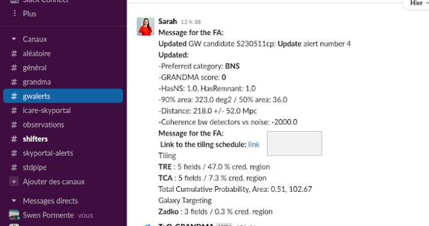
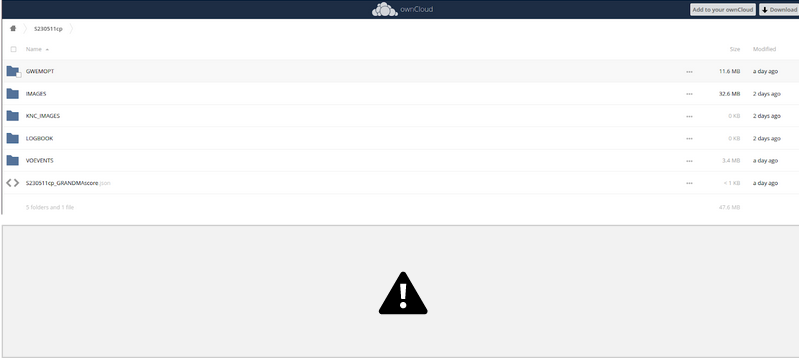
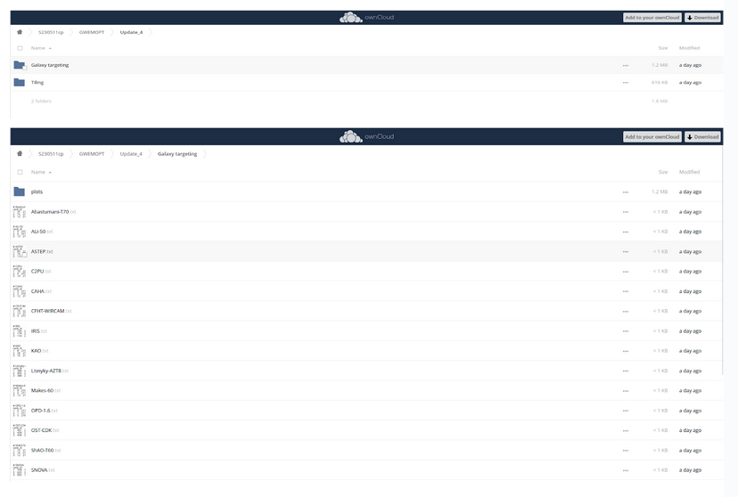
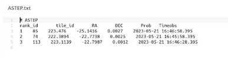
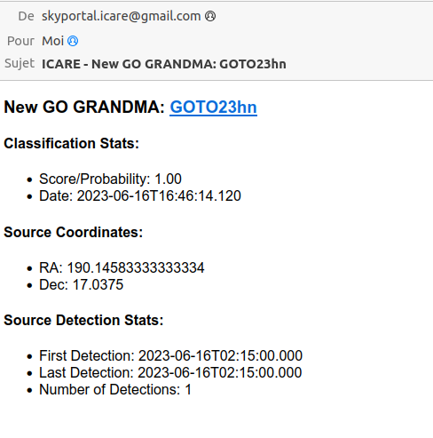
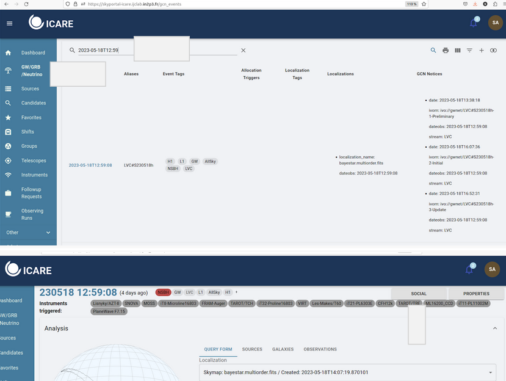

## Retrieve observation plans (Only for telescope teams)

1. Retrieve your data promptly after a GW alert (finding GW counterpart candidates)

You received a notification of gw alert on slack (#gwalerts)

It looks like this:

Click on the link in order to go to the owncloud. You will arrive on the page of the source (let's take the example S230511cp like source).  {#click-on-the-link-in-order-to-go-to-the-owncloud.-you-will-arrive-on-the-page-of-the-source-lets-take-the-example-s230511cp-like-source. .unnumbered}

Then, go to the folder "GWEMOPT"-\>the Update folder (if it exists, otherwise go to preliminary)-\>galaxy targeting/tiling. Or tiling (if bigger aperture telescopes) 

Finally, find your telescope in "galaxy targeting" (or in "tiling" if it is not in this folder). {#finally-find-your-telescope-in-galaxy-targeting-or-in-tiling-if-it-is-not-in-this-folder. .unnumbered}

### Example with images

For the moment, I will take ASTEP like example but you have to find the file: Name_of_your_telescope.txt.  {#for-the-moment-i-will-take-astep-like-example-but-you-have-to-find-the-file-name_of_your_telescope.txt. .unnumbered}

In this file, there are the tiles you have to observe (the first tile is the most likely to find the source and the last is the worst).  {#in-this-file-there-are-the-tiles-you-have-to-observe-the-first-tile-is-the-most-likely-to-find-the-source-and-the-last-is-the-worst. .unnumbered}

Be careful, [*the name of the columns and the numbers are not well aligned*.]{.underline} You have the id in the file, the tile id, the RA and DEC coordinates, the probability and the times in UTC.

2. Retrieve your data promptly after a GW alert (finding GW counterpart candidates)

When the Follow-up advocate queries observations on a GW counterpart candidate (e.g a transient within the GW sky localization area and that might be the optical signature of the GW event), the follow-up advocate will flag the source as GO GRANDMA. 

You will receive an email that will indicate you to follow-up. 

3. Notify the follow-up advocate

For the moment you have all the information you need to begin the observations but you have to inform the rest of GRANDMA that you are ready to observe.

In case of observations taken just after a GW alert, to find GW counterpart candidates:

To do this, two things to do:

* On slack (#observations), write: 
I received the plan and I will start observing with {Name_of_your_telescope_id} id {the one you are observing} tile id { tile_id 'the tile_id corresponding} RA{RA} DEC{DEC} probability{probability} on preliminary/update date{date} 

For example, if I want to observe the first tile in the file ASTEP.txt, my id is 1, the tile id is 55 and I follow the data in the corresponding line,

My sentence will be:

"*I received the plan and I will start observing with ASTEP id 1 tile id 55 ra 221.338200 dec 23.809400 probability 0.003400 on preliminary date 2023-05-22T16-56-43"* 

* The second step is to put the information in the social part of the source in ICARE

Search for event: Go to GW/GRB/Neutrino and use to source date to search it in the site.

