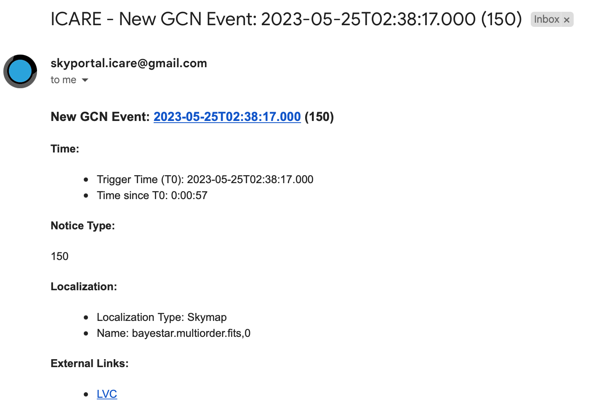

## An GW alert has been received!

-   Via email:

1.  Click on the external link to check what kind of event it is (look
    for the same parameters that were discussed in training but in the
    external link- Preferred event type (BNS, BHNS); 90% and 50%
    localizations (less than 200 deg2) and distance (less than 200 Mpc).
    **#gwalert on slack is automatized. Maybe we still have issue with
    the automatic production of plans.**

2.  If it is BHNS/BNS and it meets one of the 90%, 50% or distance
    criteria we have scope to observe it, **so notify on #observations
    on slack for new alert. Send message "New alert: name of alert; list
    of parameters. We will now wait for observation plan to be
    created"**

3.  Go to owncloud and wait for an observation plan to be created. You
    can check if one has been created by following these steps: GW\>Name
    of alert\>GWEMOPT\>preliminary alert\>tiling/galaxy targetting. Once
    this is done, update with #observations

4.  If you see an observation plan, you must now begin notifying the
    telescope teams: to do this; follow these steps

-   Go to skyportal and follow the instructions from the cookbook
    starting at "Selecting optical observations related to the GW
    event:"

