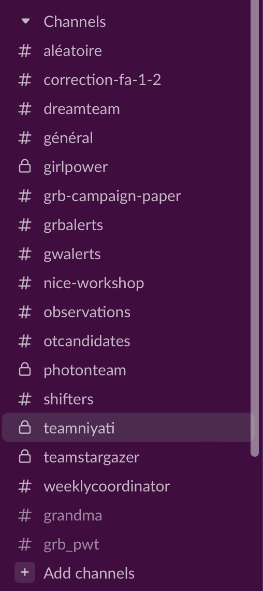
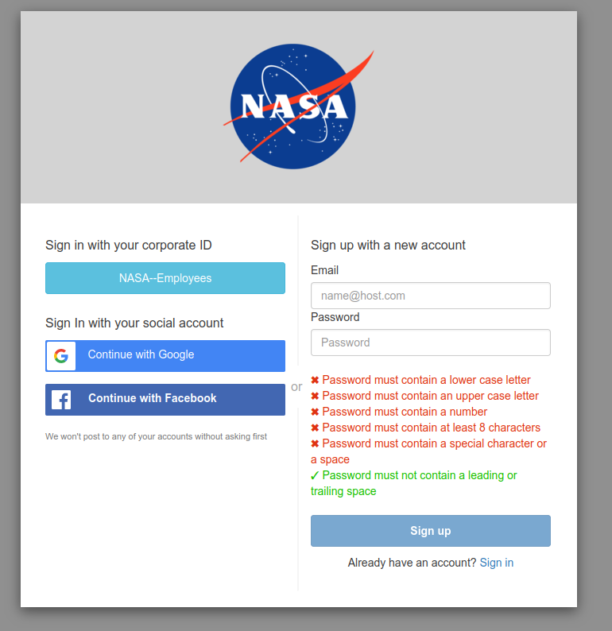
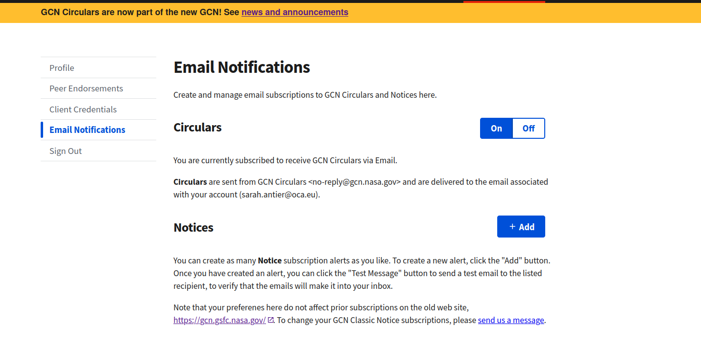
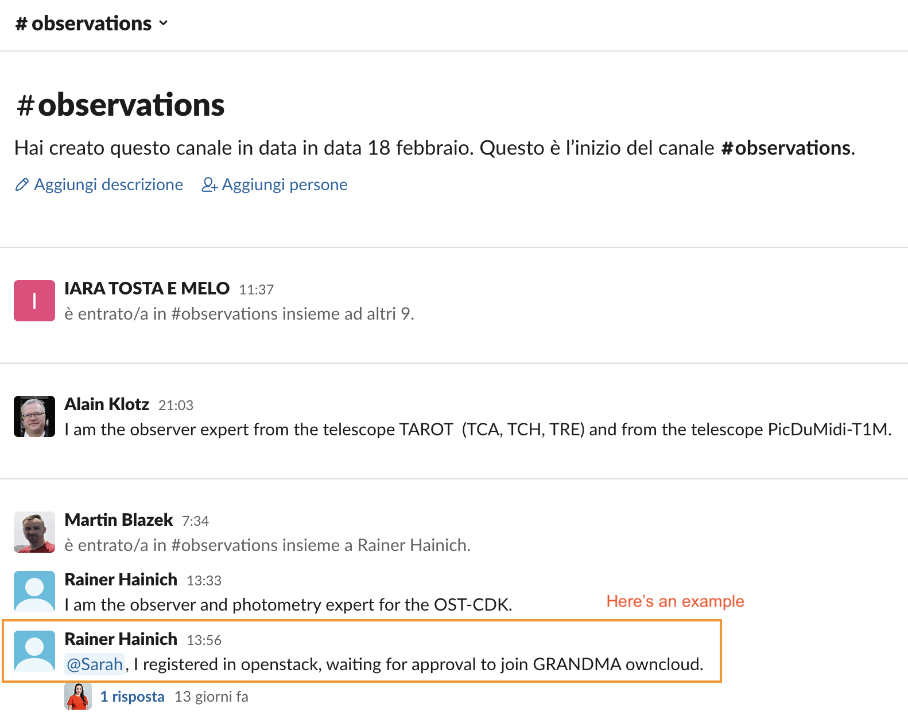
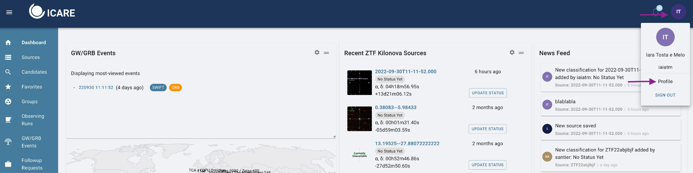
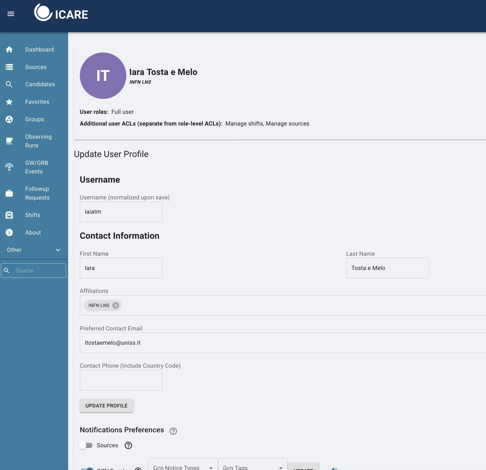
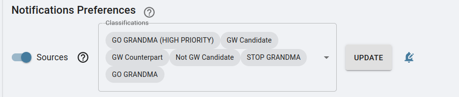
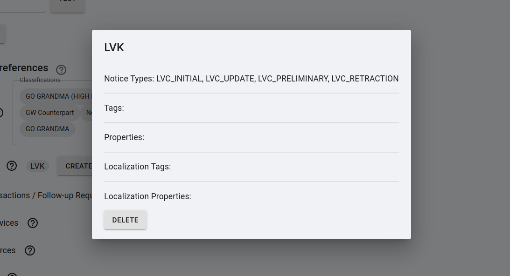
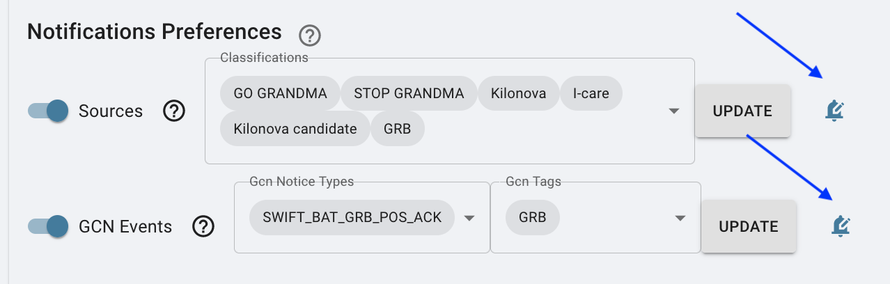
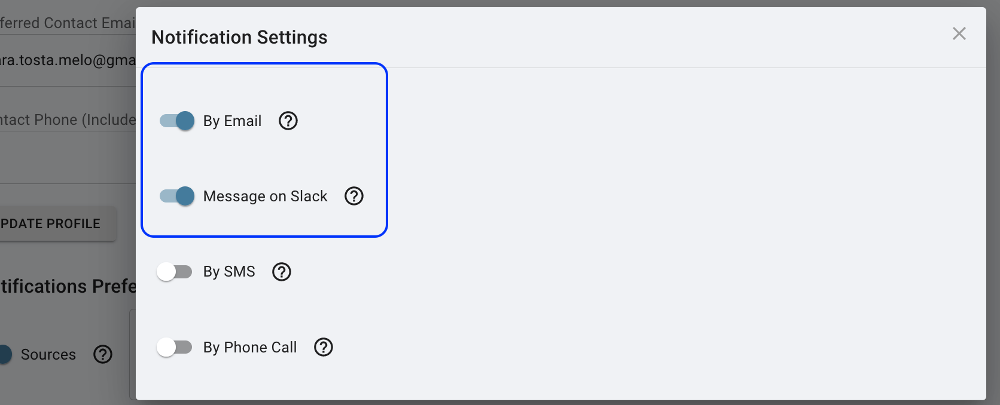

## Signing Up for GRANDMA accounts

The following are the platforms we need to connect to:

1.  [Slack](#subscribing-to-slack)

2.  [GCN Website](#getting-a-gcn-account)

3.  [Owncloud](#connecting-to-grandmas-owncloud)

4.  [I-care/Skyportal](#connecting-to-icare-skyportal)

### Subscribing to Slack

**1. Subscribing to Slack:** join the GRANDMA
slack to stay connected and communicate with the team.

As soon as you have joined slack, please **enter the following
channels**:

-   [#gwalerts](https://grandmagroupe.slack.com/archives/CFRQQEV6W)

-   [#shifters](https://grandmagroupe.slack.com/archives/CH1MM2D4H)

-   [#observations](https://grandmagroupe.slack.com/archives/C0339NGQBNK)

You can do this by going to **"Channels"** on the right sidebar and then
clicking **"add channels."** Browse the channels to find the ones you
wish to join.

### Getting a GCN Account

1.  **Get a GCN account:** You also need to get a GCN account, GCN is
    the system used by researchers in astrophysics around the world to
    send out updates and circulars of the observations they have made,
    and any sources/data they find through their analysis. Like GRANDMA,
    there are other teams performing observations and so we use this
    system to stay up to date.

To get an account, please access this link:
[https://gcn.gsfc.nasa.gov/gcn3_circulars.html](https://gcn.gsfc.nasa.gov/gcn3_circulars.html)

This process may take a while, and you need to add someone to grant you.
It can be
[sarah.antier@oca.eu](mailto:sarah.antier@oca.eu)

Activate the notifications on the circular, go to profile and turn on
the circulars button

### Connecting to GRANDMA's Owncloud

1.  [**Connect to GRANDMA owncloud:** Owncloud is like the google drive
    for GRANDMA; it is where we will store all the data from
    observations and any analysis of the alerts through our
    pipelines.]

Click the following link to connect to owncloud:

[https://grandma-owncloud.lal.in2p3.fr/index.php/apps/files/?dir=/Candidates/GW&fileid=1069468](https://grandma-owncloud.lal.in2p3.fr/index.php/apps/files/?dir=/Candidates/GW&fileid=1069468)

**If you don't have access**, it means you need to create an
"openstack" account. To do this, register at
[https://registration.lal.in2p3.fr/](https://registration.lal.in2p3.fr/)
and keep your password and your username.

-   ***If you have previously had an account and lost it or want to
    change your email address from a previous account:*** contact Gerard
    Marchal Duval
    \<[[marchal@lal.in2p3.fr]{.underline}](mailto:marchal@lal.in2p3.fr)\>
    otherwise proceed to the next step

As soon as you complete the above steps, [message in the #observations
channel]{.underline}:
"[@Sarah](https://grandmagroupe.slack.com/team/UFR2W0MQQ),
I registered in openstack, waiting for approval to join GRANDMA
owncloud"

Sarah will grant you access (this may take 24 hours). You will have
access to GRANDMA's owncloud which you can open anytime using:
[[https://grandma-owncloud.lal.in2p3.fr/index.php/apps/files?dir=/&fileid=205286]{.underline}](https://grandma-owncloud.lal.in2p3.fr/index.php/apps/files?dir=/&fileid=205286)

### Connecting to ICARE Skyportal

1.  **Joining I-Care/Skyportal:** we are going to use SkyPortal in our
    observational campaigns. This platform will be the interface we use
    to conduct the campaign, including receiving alerts, contacting
    teams, updating data, etc.

First, you need to subscribe and access it through the link:

[https://skyportal-icare.ijclab.in2p3.fr/](https://skyportal-icare.ijclab.in2p3.fr/)

As soon as you connect to it, you will see a page like the following one
(if not, click on Dashboard on the right sidebar). Your initials should
appear on the top corner on the right.

Ps: if you do not see this page, make sure to click on *Dashboard.*

[Setting your Profile in SkyPortal:]{.underline}

The next thing will be to activate the notifications you would like to
receive. As FAs you need to go to your profile to be able to change your
notifications preferences:

In your profile page, make sure **your email is correct** as you are
going to receive information about our campaign there.

On the "Notifications Preferences", you will have to indicate which
sources you would like to receive a notification by email.

The options to select on this part will be different if you are an FAs,
observer or both.

#### For Follow-Up Advocates:

***[When making any setting changes, press update at each line where it
appears.]{.underline}***

You have to turn on the "Sources" button and select **GW CANDIDATE and
GW COUNTERPART** from a list of option.

Click on Update !

For GCN events : create LVK and add LVC_INITIAL, LVC_UPDATE,
LVC_PRELIMINARY, LVC_RETRACTION

**[DO NOT FORGET TO PRESS UPDATE FOR YOUR OPTIONS AND SET UP THE
NOTIFICATIONS SETTINGS (BELL SYMBOL)!!!]{.underline}**

#### For Telescope Teams (only):

[You also have to set as sources the options:]{.underline}

**GO GRANDMA and STOP GRANDMA**

**Also Observation \_plan**

**[DO NOT FORGET TO PRESS UPDATE!!!]{.underline}**

#### For Follow-Up Advocates & Telescope Teams:

Below the "sources" you will find the "GCN Events" option. Make sure to
turn on this option and then click in "create new profile". This new
profile you will have to filter the event as below:

Your GCN Events should have: **[LVC_PRELIMINARY, LVC_INITIAL,
LVC_UPDATE, LVC_RETRACTION]** under "GCN Notice Types" and **GW**
under "GCN Tags". As seen below:

**[DO NOT FORGET TO PRESS UPDATE FOR YOUR OPTIONS AND SET UP THE
NOTIFICATIONS SETTINGS (BELL SYMBOL)!!!]{.underline}**

In all cases, you need to make sure to set the options to receive the
alerts by email and on slack by clicking on the "bell" symbol"

You need to turn on the options to receive the alerts by email and
slack

