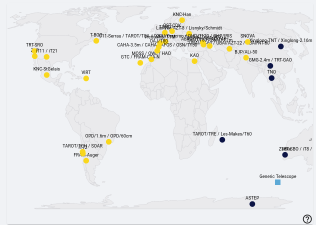

## Notifying Telescopes {#notifying-telescopes .unnumbered}

The list of telescopes contact is available in this link :
[[https://forge.in2p3.fr/attachments/211244]{.underline}](https://forge.in2p3.fr/attachments/211244)

In case of GW alerts, the telescope teams need to provide some feedback
whether or not they receive the plan well, if they plan to observe etc.
If you do not hear from them, please make sure to have some new
information 2h before their night.

You can see the list of telescopes in dark or sunlight in the main
dashboard of skyportal.

{width="6.5in" height="4.625in"}

As mentioned previously, it is always ideal to have a small sky area for
the GW alert - so, if possible, it's good to wait for the 50% sky area
to activate observations for [BNS and BHNS GW alerts.]{.underline}

The sky localization of the GW alerts given by the LVK collaborations
looks like a banana shape (usually big) and for this reason, we do not
have only one localization of the source but several.

Telescope teams will them need to receive more than one localization to
perform observations to cover the entire sky map.

Depending on the FOV of the telescopes, the entire coverage of the sky
map might be very timing consuming and so, instead of giving regions
within the sky maps to observe, we select galaxies to observe within
it - galaxies targeting

You can check out Sarah's explanation here:
<https://www.youtube.com/watch?v=msaYv1E_Cv8> 

One example of the logbook template you can use to keep track of
communication between your team.

## LogBook Template {#logbook-template .unnumbered}

---\-\-\-\-\-\-\-\-\-\-\-\-\-\-\-\-\-\-\-\-\-\-\-\-\-\--

**Template:**

**DD-MM-YYYY**

**"Your Name/Weekly Coordinator's Name" on duty "your shift slot" UTC**

**"Events of Shift Here"**

**(or if an alert has been detected:)**

**" New alert: "name of alert"**

**Parameters: "list of parameters"; Observation Plan?;Go-GRANDMA?;**

**"Instrument: (observation plan or not, performed ? why ?**

**For the ones who are not in night time: NIGHT: "when night time
occurs")"**

**Instruments:**

**VLT-FORS2: sarah.antier@oca.eu, Antonio De Ugarte
\<deugarte@oca.eu\>**

**If you think you do not have any answer yet from professional and the
source seems**

**interesting, trigger KNC by contacting:**

**KNC \[by email to Sarah Antier (sarah.antier@oca.eu) and TURPIN
Damien**

**(damien.turpin@cea.fr)**

**\*\*\*\*\*\*\*\*\*\*\*\*\*\*\*\*\*\*\*\*\*\*\*\*\*\*\*\*\*\*\*\*\*\*\*\*\*\*\*\*\*\*\*\*\*\*\*\*\*\*\*\*\*\*\*\*\*\*\*\*\*\*\*\*\*\*\*\*\*\*\*\*\*\*\*\*\*\*\*\*\*\*\*\*\*\*\*\*\*\*\*\*\*\*\*\*\*\*\*\*\*\*\*\*\***

**\*\*\*\*\*\*\*\*\*\*\*\*\*\*\***

**Template:**

**DD-MM-YYYY**

**"Your Name/Weekly Coordinator's Name" on duty "your shift slot" UTC**

**"Events of Shift Here"**

**(or if an alert has been detected:)**

**" New alert: "name of alert"**

**Parameters: "list of parameters"; Observation Plan?;Go-GRANDMA?;**

**"Instrument: (observation plan or not, performed ? why ?**

**For the ones who are not in night time: NIGHT: "when night time
occurs")"**

**DAY 0 report (observation plan or not, performed ? why ?)**

**TCH:**

**TCA:**

**TRE:**

**FZU-Auger:**

**FZU-CTA-N:**

**MOSS:**

**OWL:**

**TRT-SRO:**

**Zadko:**

**TRT-SBO:**

**TRT-GAO:**

**TNT (China)**

**NOWT:**

**ALi-50:**

**SNOVA:**

**UBAI-T60N/S:**

**Makes-60:**

**ShAO-T60:**

**Abastumani-T70:**

**Lisnyky-AZT8:**

**KAO:**

**OST-CDK:**

**VIRT:**

**SOAR-photo:**

**ASTEP:**

**OPD-1.6/0.6/0.4:**

**(Special demands (see above))**

**Makes-T60 :**

**SOAR :**

**CFHT/MEGACAM :**

**CFHT/WIRCAM :**

**KNC :**

**GMG:**

**GTC:**

**Xinglong-2.16m \[only if the source is brighter than 17.5 mag and only
for spectroscopy\]**

**VLT/FORS2:**

**SALT:**

**OAJ:**

**DDOTI:**

**TNT (Thailand)**

**ShaAO-2m:**

**T1Picdumidi:**

**Zadko:**

**C2PU:**

---\-\-\-\-\-\-\-\-\-\-\-\-\-\-\-\-\-\-\-\-\-\-\-\-\-\--

Remember to Inform the next FA of the time in UTC which of the next
telescopes need to be contacted as night-time occurs for them.

---\-\-\-\-\-\-\-\-\-\-\-\-\-\-\-\-\-\-\-\-\-\-\-\-\-\--

[Example for when there are no new observations AND changes had to be
made for another alert from a previous shift. This information can be
monitored and found in #observations. Expect more extensive details
should there be an actual alert:]{.underline}

25-5-2023

Cristina Andrade/Vini Rupchandani on duty 22h-04h UTC

No new observations. Tagged alert GW230525 with "BBH" and "Not I-care".
Removed "GO-GRANDMA".

Other: Organized images.

---\-\-\-\-\-\-\-\-\-\-\-\-\-\-\-\-\-\-\-\-\-\-\-\-\-\--

[Example for when there was an alert during your shift (Flag also the
data analysis):]{.underline}

25-5-2023

Cristina Andrade/Vini Rupchandani on duty 22h-04h UTC

New alert: GW candidate S230525a

Parameters: NSBH, -90% area: 1001.0 deg2 / 50% area: 266.0

-Distance: 276.0 +/- 79.0 Mpc, GRANDMA Score: 2, GO-GRANDMA.

Instruments:

TCH:

TCA:

TRE:

FZU-Auger:

FZU-CTA-N:

OAJ:

CFHT-MEGACAM:

DDOTI:

MOSS:

OWL:

TRT-SRO:

Zadko:

TRT-SBO:

CFHT-WIRCAM:

TRT-GAO:

TNT:

ALi-50:

SNOVA:

UBAI-T60N: No Observation Plan.

Makes-60:

ShAO-T60: Received Observation Plan. Unable to Observe due to
probability is 0.0005.

Abastumani-T70: Received Observation Plan

Lisnyky-AZT8:

KAO:

OST-CDK:

C2PU:

IRIS:

CAHA:

VIRT:

SOAR-photo:

ASTEP:

OPD-1.6:
