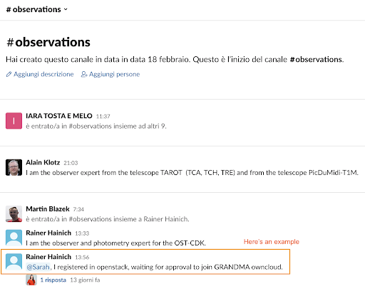
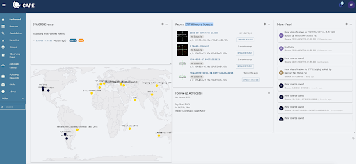
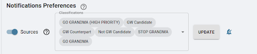
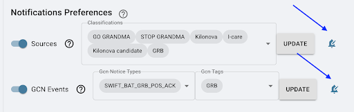
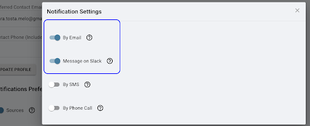

# 1. Signing Up for GRANDMA’s Utilities

The following are the platforms we need to connect to:
- [Slack](https://join.slack.com/t/grandmagroupe/shared_invite/zt-14wn7vx6f-JzSBq0bJLPWDKOzntNlElQ)
- [GCN Website](https://gcn.nasa.gov/ )
- [OwnCloud](https://grandma-owncloud.lal.in2p3.fr/index.php/apps/files/?dir=/&fileid=426275)
- [I-care/Skyportal](https://skyportal-icare.ijclab.in2p3.fr/)
- [FORGE](https://forge.in2p3.fr/)

## 1.1 Subscribing to Slack

Subscribing to Slack: using the following link, join the GRANDMA Slack to stay connected and communicate with the team: [Join GRANDMA Slack](https://join.slack.com/t/grandmagroupe/shared_invite/zt-14wn7vx6f-JzSBq0bJLPWDKOzntNlElQ)

As soon as you have joined Slack, please enter the following channels:
- `#gwalerts`
- `#shifters`
- `#observations`
- `#training`
- `#grandma`

You can do this by going to "Channels" on the right sidebar and then clicking "add channels." Browse the channels to find the ones you wish to join.

## 1.2 Turning on Slack Notifications

### 1.2.1 General Slack Notifications

1. **Open Slack**: Open the Slack desktop or mobile app.

2. **Navigate to Preferences**: 
   - On desktop: Click on your workspace name at the top left corner of the screen, then select "Preferences" from the dropdown menu.
   - On mobile: Tap on the three horizontal lines at the top left corner, then select "Preferences".

3. **Select Notifications**: In the Preferences menu, locate and click on "Notifications & Sound" from the left-hand menu.

4. **Adjust your settings**: Set your notification preferences, ensuring they don't interfere with your shift times.

   These settings affect the hours when you will receive notifications in other channels. Be diligent!

### 1.2.2 Channel-Specific Notifications

1. **Ensure notifications are on** for `#gwalerts`, `#observations`, `#shifters`, and your shift group-specific channel.

2. **Customize Notification Settings**:
   - Scroll down to the channel of choice in the list of channels on the left side panel.

3. **Navigate to Channel Settings**: 
   - On desktop: Click on the channel name at the top left corner of the channel screen.
   - On mobile: Click on the channel name at the top of the screen.

4. **Select Channel Notifications**:
   - On desktop: A pop-up will appear. Go to the top and click where it says "Get Notifications for…". Adjust the notification settings for the channel here.
   - On mobile: Scroll down to notifications and adjust preferences accordingly.

   Make sure that you are receiving all messages in these channels.
   

## 1.3 Getting a GCN Account

1. **Get a GCN account**: GCN (Gamma-ray Coordinates Network) is a system used by astrophysics researchers worldwide to send out updates and circulars of their observations and data findings. Like GRANDMA, other teams also perform observations, so this system keeps everyone up to date.

2. **To get an account**: 
   - Visit [GCN](https://gcn.nasa.gov/) (or for more detailed instructions, you can also check the old link: [GCN Circulars](https://gcn.gsfc.nasa.gov/gcn3_circulars.html)).
   - Sign up with a new account.

   **Note**: The process may take some time, and you need to have someone grant you permission. You can ask sarah.antier@oca.eu or any other GRANDMA member who already has access.

3. **Activate notifications**:
   - Go to your profile and turn on the circulars button to receive notifications on the circulars.

## 1.4 Connecting to GRANDMA’s Owncloud

**Connect to GRANDMA Owncloud**: Owncloud is like Google Drive for GRANDMA; it is where we will store GCNs, all the data from observations, and any analysis of the alerts through our pipelines.

Click the following link to connect to Owncloud: [GRANDMA Owncloud](https://grandma-owncloud.lal.in2p3.fr/index.php/apps/files/?dir=/Candidates/GW&fileid=1069468)

If you don’t have access, you need to create an “openstack” account. To do this, register at [Openstack Registration](https://registration.lal.in2p3.fr/) and keep your password and username.

If you have previously had an account and lost it or want to change your email address from a previous account, contact Gerard Marchal Duval at [marchal@lal.in2p3.fr](mailto:marchal@lal.in2p3.fr). Otherwise, proceed to the next step.

As soon as you complete the above steps, message in the `#grandma`, `#observations`, or `#training` channel: “@Sarah, I registered in Openstack, waiting for approval to join GRANDMA Owncloud.”

Sarah will grant you access (this may take 24 hours). You will have access to GRANDMA’s Owncloud, which you can open anytime using: [GRANDMA Owncloud Files](https://grandma-owncloud.lal.in2p3.fr/index.php/apps/files?dir=/&fileid=205286)

## 1.5 Connecting to ICARE Skyportal

**Joining I-Care/Skyportal**: We will use SkyPortal in our observational campaigns. This platform will be the interface we use to conduct the campaign, including receiving alerts, contacting teams, updating data, etc.

First, subscribe and access it through the link: [SkyPortal I-Care](https://skyportal-icare.ijclab.in2p3.fr/)

As soon as you connect, you will see a page like the following (if not, click on "Dashboard" on the right sidebar). Your initials should appear in the top right corner.

**Note**: If you do not see this page, make sure to click on "Dashboard".

### Setting Your Profile in SkyPortal

The next step is to activate the notifications you would like to receive. As FAs, you need to go to your profile to change your notification preferences:

1. In your profile page, ensure your email is correct as you will receive information about our campaign there.
2. On the “Notifications Preferences” page, indicate which sources you would like to receive notifications about by email. The options will vary if you are an FA, observer, or both.

#### 1.5.1 For Follow-Up Advocates:

1. When making any setting changes, press "Update" at each line where it appears.
2. Turn on the “Sources” button and select `GW CANDIDATE` and `GW COUNTERPART` from the list of options.

  
4. Click on "Update!"

   For GCN events, create `LVK` and add `LVC_INITIAL`, `LVC_UPDATE`, `LVC_PRELIMINARY`, `LVC_RETRACTION`.

   **DO NOT FORGET TO PRESS UPDATE FOR YOUR OPTIONS AND SET UP THE NOTIFICATIONS SETTINGS (BELL SYMBOL)!!!**

#### 1.5.2 For Telescope Teams (only):

1. Set as sources the options: 
   - `GO GRANDMA`
   - `STOP GRANDMA`
   - `Observation_plan`

   **DO NOT FORGET TO PRESS UPDATE!!!**

#### 1.5.3 For Follow-Up Advocates & Telescope Teams:

1. Below the “sources” section, find the “GCN Events” option. Ensure this option is turned on, and then click on “create new profile.” In this new profile, filter the event as follows:

   Your GCN Events should have: 
   - `LVC_PRELIMINARY`
   - `LVC_INITIAL`
   - `LVC_UPDATE`
   - `LVC_RETRACTION` under “GCN Notice Types”
   - `GW` under “GCN Tags”

   **DO NOT FORGET TO PRESS UPDATE FOR YOUR OPTIONS AND SET UP THE NOTIFICATIONS SETTINGS (BELL SYMBOL)!!!**

In all cases, make sure to set the options to receive alerts by email and on Slack by clicking on the “bell” symbol.

You need to turn on the options to receive alerts by email and Slack.

## 1.6 Getting a FORGE Account

**FORGE** is where GRANDMA’s active documents and event lists are located. This is where we store our meeting minutes, project information, and the GRANDMA email list.

1. Go to [FORGE](https://forge.in2p3.fr/).
2. Select **Register** in the upper right.
3. When you get to the following page, make sure to select **“Join an existing project”** and type in **“GRANDMA”**. Refer to Sarah Antier in the comment section.
4. Then, email or contact her through Slack to gain access.

