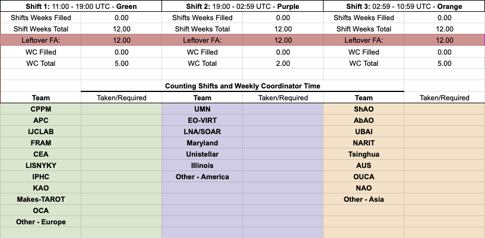
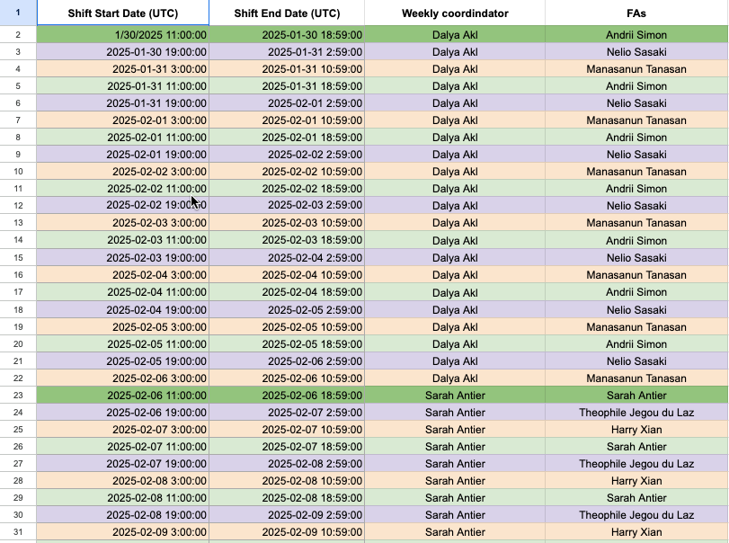
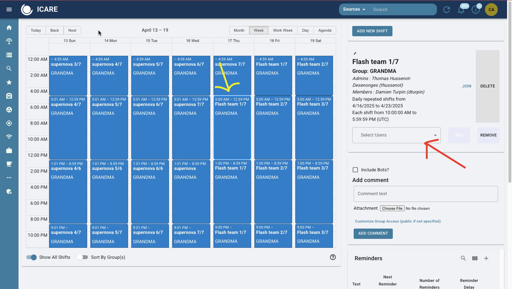

# 2. Enrolling in Shifts

You are a shifter or "follow-up advocate (FA)" and need to sign up! 

**Note:** The starting of each weekly slot will be on Thursdays at 11 UTC. The same day as the weekly meeting. 

A week of shifts will have **three** shift slots per day, with a weekly coordinator overseeing the three shifters. The daily shift rota will be divided by relative time zones: 
  - Shift 1: 11:00 - 19:00 UTC - Green
  - Shift 2: 19:00 - 02:59 UTC - Purple		
  - Shift 3: 02:59 - 10:59 UTC - Orange

## 2.1 Shift Sign Up: Spreadsheet 

You will be sorted by your group name which you can see on the shift spreadsheet, titled ["Shift_P#"](https://docs.google.com/spreadsheets/d/1altJ57g31-rkn9dT9o7fLb7BpJpsi19Ies5Cx7t26Us/edit?usp=sharing). 

Each dark green row indicates the first shift of a new week. 

Make sure to fill in your name in Column, titled "FAs" - based on the color of the column where your GROUP name is located. This corresponds to your time zone.

Fill your name in 7 times for that week. It will look like this:

If you aren't sure what your group is, go to sheet "Shifts count (FA&WC) O#b-part#" and find your name. The "I" column is your group name.

## 2.2 Shift Sign Up: Skyportal
Once you have selected your week on the spreadsheet, go to SkyPortal and find the corresponding date. A week of shifts should have been made on this point and it should like this: 

Notice that the yellow arrow is aligning on a thursday - when a week of shifts begin. Look for the date where your shift begins and find your time slot. **Remember:**: Shift slots start at 1100h UTC. 

The red arrow is pointing to the selected shift "Flash Team 1/7". This is the name of the team that is on shift followed by the day of shifts out of seven (day 1/ day 7). The name of the weekly coordinator is on top under "Admins". Your name should be on "Members". 

Right above the red arrow, click the word "Join" to add your name to the slot. Do this seven times along the same time slot for the week. You are signed up!!!

**NOTE:** If you go to sign up on SkyPortal and there is no week of shifts made, inform Cristina (andra104@umn.edu) and she can help you. 
