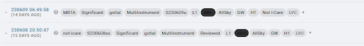
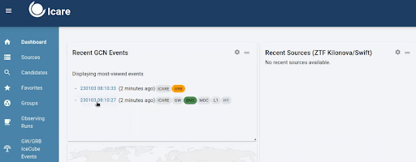

# 3. Checking Alerts & Determining Follow Up

In this campaign, we will follow GW alerts, GRBs, and other fast transients.

## 3.1 Gravitational Waves 

There will be different classifications of GW alerts: preliminary, early, initial, and updated.

### 3.1.1 Preliminary Alerts

As soon as LVK detects an event, a **PRELIMINARY** alert will be shown in the `#gwalerts` Slack channel and `#skyportal-alerts`, which will include a skymap. A skymap means that our telescopes can start observing within the indicated sky area. As an FA, you should notify the telescopes about the event and request observations. Check Sarah’s video to understand whether the preliminary alert should be followed or not.

In the `#gwalerts` Slack channel and `#skyportal-alerts`, there is a message to assist you if you have any doubts.

**Note:** In O4, we only deal with “significant” alerts. This means the FAR should be at least 12 per year (with significant being equal to 1).

Sarah’s video provides a detailed explanation of the **PRELIMINARY** GW ALERT, including how it appears in the `#gwalerts` Slack channel and `#skyportal-alerts`, and which alerts are best followed by GRANDMA: [Watch Video](https://www.youtube.com/watch?v=b0HGRygGzrE). 

**Summary:** Focus on GW alerts coming from BNS and BHNS, relatively near (below 200 Mpc), with an area below 200 deg², and a GRANDMA score of 2, 3, or 4. If these requirements are met, request follow-up observation as soon as you receive the first GW alert/PRELIMINARY.

If the alert does not meet these specifications, wait for the **UPDATED** classification of the same GW alert. If the source does not satisfy these requirements, remove the tag `GO GRANDMA` and add the tag `not-Icare` by appending `+`.

**Note:** We do not consider whether HasRemnant is 1 or 0.

Moreover, if you have started observations, once all observations are completed, remove the `GO GRANDMA` tag and add `STOP GRANDMA` with `+`.

In both cases, ensure the event name is added as “S230609u”; it is not automatic.

### 3.1.2 Initial Alerts

If the GW alert is classified as **INITIAL**, it will indicate whether the alert is of astrophysical origin (this will also include a skymap). In some cases, the alert may be retracted if it is not of astrophysical origin, and you should request to stop observations if they have already started.

### 3.1.3 Updated Alerts

When receiving an **UPDATED** classification of the same GW alert, you can inform the telescopes about the new skymap related to the alert, which will have a better area. Follow-up observation may start after this classification if the area reported in the preliminary was greater than 50%.

**Remember:** We do not request follow-up observations for GW alerts classified as early, as no skymap is related to these alerts.

You will also see the GW alerts in SkyPortal. On the dashboard, you will find the most recent GW alerts and their classifications.

## This can also be explained on the [GCN website](https://gcn.nasa.gov/missions/lvk) for the LVK mission.

## 3.2 Gamma Ray Bursts & Reading from GCN Circulars 

