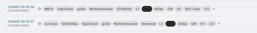
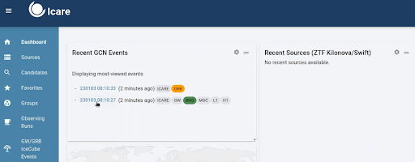

# 4. Determining GW Follow Up

In this campaign, we will follow GW alerts, GRBs, and other fast transients. This section will discuss how to determine follow up for GRANDMA's primary target of GW alerts with BNS/NSBH progenitors.

## 4.1 Gravitational Waves 

There will be different classifications of GW alerts that are distributed by the gravitational wave interferometers: LIGO, VIRGO, KAGRA (LVK). These different alert types are: preliminary, early, initial, and updated. These will be ingested by slack where you will recieve an alert in the `#gwalerts` channel. 

**We are to follow up on GW alerts that meet the following criteria:**
1. Preferred event type (BNS, BHNS)
2. 90% and 50% localizations (less than 200 deg²)
3. Distance (less than 200 Mpc)
4. GRANDMA Score of 2,3, or 4. 

**Note:** In O4, we only deal with “significant” alerts. This means the FAR should be at least 12 per year (with significant being equal to 1).

### 4.1.1 Preliminary Alerts

As soon as LVK detects an event, a **PRELIMINARY** alert will be shown in the `#gwalerts` Slack channel and `#skyportal-alerts`, which will include a skymap. A skymap means that our telescopes can start observing within the indicated sky area. As an FA, you should wait til the intial or updated alert before responding in #observations. If it is a particularly interesting event, you can notify the #observations channel about the event and then wait for an update before requesting observations. 

In the `#gwalerts` Slack channel and `#skyportal-alerts`, there is a message to assist you if you have any doubts.

Sarah’s video provides a detailed explanation of the **PRELIMINARY** GW ALERT, including how it appears in the `#gwalerts` Slack channel and `#skyportal-alerts`, and which alerts are best followed by GRANDMA: [Watch Video](https://www.youtube.com/watch?v=b0HGRygGzrE). 

**Summary:** Focus on GW alerts coming from BNS and BHNS, relatively near (below 200 Mpc), with an area below 200 deg², and a GRANDMA score of 2, 3, or 4. If these requirements are met, request follow-up observation as soon as you receive the first GW alert/PRELIMINARY.

If the alert does not meet these specifications, wait for the **UPDATED** classification of the same GW alert. If the source does not satisfy these requirements, remove the tag `GO GRANDMA` and add the tag `not-Icare` by appending `+`.

**Note:** We do not consider whether HasRemnant is 1 or 0.

Moreover, if you have started observations, once all observations are completed, remove the `GO GRANDMA` tag and add `STOP GRANDMA` with `+`.

In both cases, ensure the event name is added as “S230609u”; it is not automatic.

### 4.1.2 Initial Alerts

If the GW alert is classified as **INITIAL**, it will indicate whether the alert is of astrophysical origin (this will also include a skymap). In some cases, the alert may be retracted if it is not of astrophysical origin, and you should request to stop observations if they have already started.

### 4.1.3 Updated Alerts

When receiving an **UPDATED** classification of the same GW alert, you can inform the telescopes about the new skymap related to the alert, which will have a better area. Follow-up observation may start after this classification if the area reported in the preliminary was greater than 50%.

**Remember:** We do not request follow-up observations for GW alerts classified as early, as no skymap is related to these alerts.

You will also see the GW alerts in SkyPortal. On the dashboard, you will find the most recent GW alerts and their classifications.

> This can also be explained on the [GCN website](https://gcn.nasa.gov/missions/lvk) for the LVK mission.
---
## 4.2 Procedure for Observing GWs

So, you've receieved an alert! What's next? 

### Via Email or Slack (check #gwalerts):

1. **Check Event Type**:
   - Click on the external link provided to check the event type.
   - Look for the same parameters discussed in training:
     - Preferred event type (BNS, BHNS)
     - 90% and 50% localizations (less than 200 deg²)
     - Distance (less than 200 Mpc)

2. **If the Alert Meets Criteria**:
   - If it is a BHNS/BNS event and meets one of the criteria for 90%, 50%, or distance, we have the scope to observe it.
   - In any case of observation, ensure the event name is added as “SYYMMDD(X)”; it is not automatic. For example, “S230609u".
   - Inform #Observations: `"New alert: name of alert; list of parameters. We will now wait for the observation plan to be created."`

> If alert does NOT meet criteria, provide the same information but with **NO FOLLOW UP** at the end. 
3. **Wait for Observation Plan**:
   - Go to OwnCloud and wait for an observation plan to be created.
   - Check if an observation plan has been created by following these steps:  
     `GW > Name of alert > GWEMOPT > Preliminary alert > Tiling/Galaxy targeting`
   - Once the plan is created, update the #observations channel.

4. **Notify Telescope Teams**:
   - Go to SkyPortal and follow the instructions from the cookbook starting at “Notifying Telescopes.”
   - Update responses using the template within the #observation channel, in skyportal comments, and with your teammates(at the end of your shift).
   - Post to Skyportal comments section about which telescopes are observing and any details surrounding those observations such as the most recent updated parameters found in the #gwalerts channel, who has uploaded images, etc.
  
     You can see examples of these comments here:
     
     

