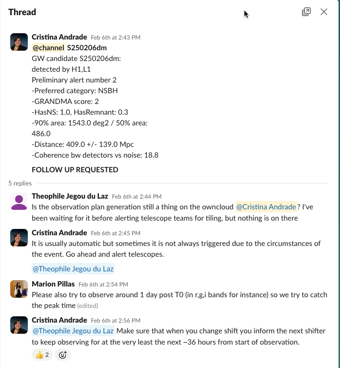
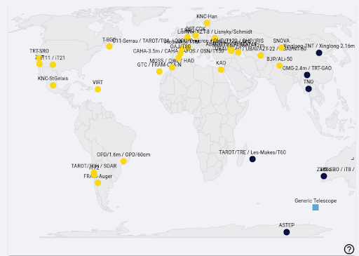

# 5. Notifying Telescopes

In GRANDMA, we notify telescopes via Slack. At the time of a quality alert, you will @channel and send details of the event AND send an email to the collaboration. You will continue to do so for 24-48 hours as we look for a optical counterpart. If it is not found in that time, we stop observing by sending a message to `#observations`.

## 5.1 Contacting Telescopes 

**Once you have determined observability, send a message in #observations with the name of the event (S###### or GRBYYMMDD) and then tag the telescope representative.**

For GRBs, make sure to include the GCN link and the coordinates when contacting telescopes. As well, send an email with the same information AND put your request in #observations. 

For GW events, **when the plans arrive**, you can contact the telescopes individually by tagging or “@contact_person” in the `#observations` channel as night arrives or if they are experiencing night when the alert arrives. When plans arrive, you send an email AND notify, again, in #observations.

For example, a message notifying `#observations` about an alert could look like this: 

**This example is for a GW alert:**

**The second example is for a GRB alert from a GCN event:**

> GO GRANDMA: GRB 250221A Swift detection of a burst with an optical counterpart, GCN 39396. Uncertainty of 3 arcmin.

>@channel Can you please observe?

>Coordinates: 
>RA, Dec 59.477, -15.139 which is 
   RA(J2000) = 03h 57m 54s
   Dec(J2000) = -15d 08' 18"

>@Aom with TRT-SRO?
>@Sergey Karpov @Martin Mašek with FRAM-CTA-N then FRAM-Auger?
>@WAGNER CORRADI OPD/1.6m and 60m 

>OwnCloud Link: https://grandma-owncloud.lal.in2p3.fr/index.php/apps/files/?dir=/Candidates/GRB/GRB250221A&fileid=1246869 

>Source: https://skyportal-icare.ijclab.in2p3.fr/source/GRB250221A

## 5.2 Contact List 

The list of telescope contacts, as of 2024, is available at this link: [Contact Telescope Teams](https://forge.in2p3.fr/attachments/download/213747/Contact%20Telescope%20teams-2.pdf). 

Familiarize yourself with the information pertaining to each telescope. Refer to it prior to making any observation decisions or plans! 

If no slack contact is available and a telescope has good observability. Look through document for the correspondent's email and inform the weekly coordinator, Cristina Andrade, or Sarah Antier.

TAROT telescope teams do not need to be contacted before requesting follow up. The system can be initiated with a follow up request as seen in the section on the use of SkyPortal.

Slack contacts are as follows:
- **@Nu**: TRT-SBO, TRT-GUAO
- **@Aom**: TRT-SBO, TRT-GUAO
- **@Haowei Peng**: Xinglong-TNT
- **@Abu**: SNOVA, NOWT
- **@Yodgor**: UBAI-T60N, UBAI-T60S
- **@Yusuf**: UBAI-T60N, UBAI-T60S
- **@Otabek Burkhonov**: UBAI-T60N, UBAI-T60S
- **@Zumrud**: ShAO-T60, ShAO-T2m
- **@Shabnam**: ShAO-T60
- **@Emin Gurbanov**: ShAO-T60
- **@Emrah Hesenov**: ShAO-T60
- **@Nariman**: ShAO-T60
- **@Sabahaddin Alishov**: ShAO-T60
- **@Nino**: Abastumani-T70
- **@Sophia Beradze**: Abastumani-T70
- **@Oleksandra Pyshna**: Lisnyky
- **@Andrii**: Lisnyky
- **@Baransky**: Lisnyky
- **@Ahmed Fouad**: KAO
- **@Ali Takey**: KAO
- **@Ahmed Shokry Elshaer**: KAO
- **@Mona**: KAO
- **@Amira Tawfeek**: KAO
- **@Zouhair Benkhaldoun**: MOSS, OWL
- **@Aziz Astro**: MOSS, OWL
- **@Ali Janati**: MOSS, OWL
- **@Rainer Hainich**: OST-CDK20
- **@Sarah**: C2PU
- **@Wagner Corradi**: OPD, SOAR
- **@Iara Tosta e Melo**: OPD, SOAR
- **@Felipe Navarete**: OPD, SOAR
- **@Nelio Sasaki**: OPD, SOAR
- **@Ted Almeida**: OPD
- **@Priyadarshini Gokuldass**: VIRT
- **@Brice Orange**: VIRT
- **@Kyle Noonan**: VIRT
- **@Swen Pormente**: ASTEP
- **@Alain Klotz**: TAROT - TRE (Réunion), TCA (France), TCH (Chile)
  
In case of GW alerts, the telescope teams need to provide feedback on whether they received the plan and if they plan to observe. If you do not hear from them, ensure you have some new information 2 hours before their night.

You can see the list of telescopes in dark or sunlight on the main dashboard of SkyPortal.

As mentioned previously, it is ideal to have a small sky area for the GW alert. Therefore, if possible, it’s good to wait for the 50% sky area to activate observations for BNS and BHNS GW alerts.

The sky localization of the GW alerts given by the LVK collaborations usually looks like a banana shape (often large), and for this reason, we do not have only one localization of the source but several. Telescope teams will need to receive more than one localization to cover the entire sky map. Depending on the FOV of the telescopes, covering the entire sky map might be time-consuming. Instead of giving regions within the sky maps to observe, we select galaxies within it for targeting.

**NOTE:** Make sure to send an email when stopping observation and to classify the source as `STOP GRANDMA` when done. 

You can check out Sarah’s explanation here: [Watch Video](https://www.youtube.com/watch?v=msaYv1E_Cv8)

