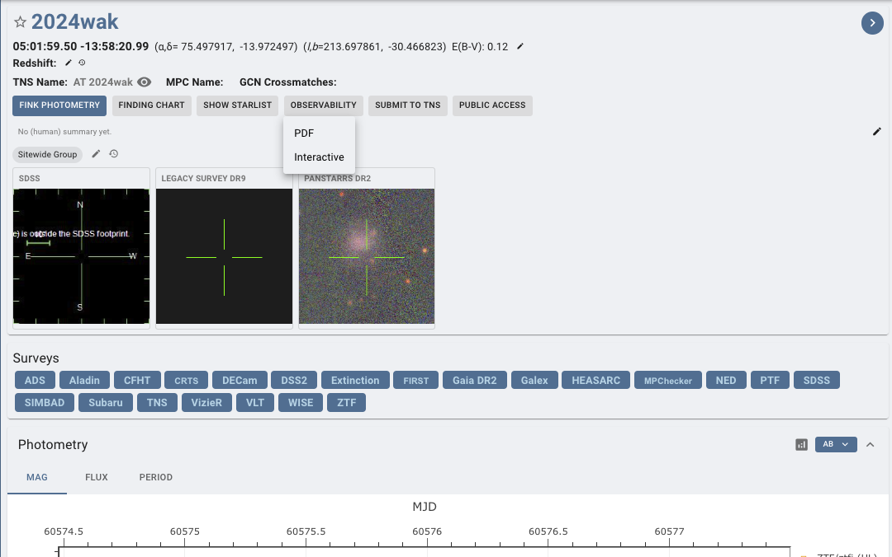

# 5. Notifying Telescopes

In GRANDMA, we notify telescopes via Slack. At the time of a quality alert, you will @channel and send details of the event. When the plans arrive, you can begin contacting the telescopes individually by tagging or “@contact_person” in the `#observations` channel as night arrives or if they are experiencing night when the alert arrives.

You can find the observability plan on skyportal. Go to the source page of the alert, click on the observability dropdown at the top of the page and click PDF. 

The list of telescope contacts, as of 2024, is available at this link: [Contact Telescope Teams](https://forge.in2p3.fr/attachments/download/213747/Contact%20Telescope%20teams-2.pdf). 

Familiarize yourself with the information pertaining to each telescope. Refer to it prior to making any observation decisions or plans! 

If no slack contact is available and a telescope has good observability. Look through document for the correspondent's email and inform weekly coordinator, Cristina Andrade, or Sarah Antier.

Slack contacts are as follows:
- **@Nu**: TRT-SBO, TRT-GUAO
- **@Aom**: TRT-SBO, TRT-GUAO
- **@Haowei Peng**: Xinglong-TNT
- **@Abu**: SNOVA, NOWT
- **@Yodgor**: UBAI-T60N, UBAI-T60S
- **@Yusuf**: UBAI-T60N, UBAI-T60S
- **@Otabek Burkhonov**: UBAI-T60N, UBAI-T60S
- **@Zumrud**: ShAO-T60, ShAO-T2m
- **@Shabnam**: ShAO-T60
- **@Emin Gurbanov**: ShAO-T60
- **@Emrah Hesenov**: ShAO-T60
- **@Nariman**: ShAO-T60
- **@Sabahaddin Alishov**: ShAO-T60
- **@Nino**: Abastumani-T70
- **@Sophia Beradze**: Abastumani-T70
- **@Oleksandra Pyshna**: Lisnyky
- **@Andrii**: Lisnyky
- **@Baransky**: Lisnyky
- **@Ahmed Fouad**: KAO
- **@Ali Takey**: KAO
- **@Ahmed Shokry Elshaer**: KAO
- **@Mona**: KAO
- **@Amira Tawfeek**: KAO
- **@Zouhair Benkhaldoun**: MOSS, OWL
- **@Aziz Astro**: MOSS, OWL
- **@Ali Janati**: MOSS, OWL
- **@Rainer Hainich**: OST-CDK20
- **@Sarah**: C2PU
- **@Wagner Corradi**: OPD, SOAR
- **@Iara Tosta e Melo**: OPD, SOAR
- **@Felipe Navarete**: OPD, SOAR
- **@Nelio Sasaki**: OPD, SOAR
- **@Ted Almeida**: OPD
- **@Priyadarshini Gokuldass**: VIRT
- **@Brice Orange**: VIRT
- **@Kyle Noonan**: VIRT
- **@Swen Pormente**: ASTEP
- **@Alain Klotz**: TAROT - TRE (Réunion), TCA (France), TCH (Chile)
  
In case of GW alerts, the telescope teams need to provide feedback on whether they received the plan and if they plan to observe. If you do not hear from them, ensure you have some new information 2 hours before their night.

You can see the list of telescopes in dark or sunlight on the main dashboard of SkyPortal.

As mentioned previously, it is ideal to have a small sky area for the GW alert. Therefore, if possible, it’s good to wait for the 50% sky area to activate observations for BNS and BHNS GW alerts.

The sky localization of the GW alerts given by the LVK collaborations usually looks like a banana shape (often large), and for this reason, we do not have only one localization of the source but several. Telescope teams will need to receive more than one localization to cover the entire sky map. Depending on the FOV of the telescopes, covering the entire sky map might be time-consuming. Instead of giving regions within the sky maps to observe, we select galaxies within it for targeting.

You can check out Sarah’s explanation here: [Watch Video](https://www.youtube.com/watch?v=msaYv1E_Cv8)

## 5.1 LogBook Template

This template is not strictly mandatory, but it is recommended to follow these parameters when communicating shift to shift and team to team. Ensure you are constantly checking for active observations, not just the new ones that occurred during your shifts.

**Template:**

**Date:** DD-MM-YYYY  
**On duty:** “Your Name/Weekly Coordinator’s Name” on duty “your shift slot” UTC

**Events of Shift Here**

(or if an alert has been detected:)

**New alert:** “name of alert”  
**Parameters:** “list of parameters”; Observation Plan?; Go-GRANDMA?;

**Instrument:** (observation plan or not, performed? Why?)  
For the ones who are not in night time: **NIGHT:** “when night time occurs”

**Instruments:**

- VLT-FORS2: sarah.antier@oca.eu, Antonio De Ugarte <deugarte@oca.eu>  
  If you do not receive any answer from professionals and the source seems interesting, trigger KNC by contacting:  
  KNC [email to Sarah Antier (sarah.antier@oca.eu) and Damien Turpin (damien.turpin@cea.fr)]

---

**DAY 0 report (observation plan or not, performed? Why?)**

- TCH:
- TCA:
- TRE:
- FZU-Auger:
- FZU-CTA-N:
- MOSS:
- OWL:
- TRT-SRO:
- Zadko:
- TRT-SBO:
- TRT-GAO:
- TNT (China)
- NOWT:
- ALi-50:
- SNOVA:
- UBAI-T60N/S:
- Makes-60:
- ShAO-T60:
- Abastumani-T70:
- Lisnyky-AZT8:
- KAO:
- OST-CDK:
- VIRT:
- SOAR-photo:
- ASTEP:
- OPD-1.6/0.6/0.4:
- (Special demands (see above))
- Makes-T60:
- SOAR:
- CFHT/MEGACAM:
- CFHT/WIRCAM:
- KNC:
- GMG:
- GTC:
- Xinglong-2.16m [only if the source is brighter than 17.5 mag and only for spectroscopy]
- VLT/FORS2:
- SALT:
- OAJ:
- DDOTI:
- TNT (Thailand)
- ShaAO-2m:
- T1Picdumidi:
- Zadko:
- C2PU:

—---------------------------
Remember to Inform the next FA of the time in UTC which of the next telescopes need to be contacted as night-time occurs for them.
—---------------------------

Example for when there are no new observations AND changes had to be made for another alert from a previous shift. This information can be monitored and found in #observations. Expect more extensive details should there be an actual alert:

25-5-2023
Cristina Andrade/Vini Rupchandani on duty 22h-04h UTC

No new observations. Tagged alert GW230525 with “BBH” and “Not I-care”. Removed “GO-GRANDMA”. 

Other: Organized images. 
—---------------------------

Example for when there was an alert during your shift (Flag also the data analysis):

25-5-2023
Cristina Andrade/Vini Rupchandani on duty 22h-04h UTC

New alert: GW candidate S230525a
Parameters: NSBH, -90% area: 1001.0 deg2 / 50% area: 266.0
-Distance: 276.0 +/- 79.0 Mpc, GRANDMA Score: 2, GO-GRANDMA. 
Contacted the following people: X, X, X, X. These are the ones who have responded.
UBAI-T60N: No Observation Plan.
ShAO-T60: Received Observation Plan. Unable to Observe due to probability is 0.0005.
Abastumani-T70: Received Observation Plan

