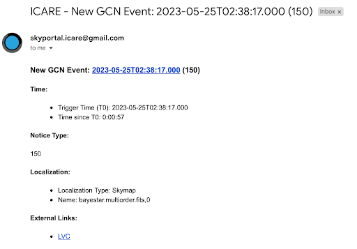

# 6. A GW Alert Has Been Received!

So, you've receieved an alert! What's next? 

### Via Email or Slack (check #gwalerts):

1. **Check Event Type**:
   - Click on the external link provided to check the event type.
   - Look for the same parameters discussed in training:
     - Preferred event type (BNS, BHNS)
     - 90% and 50% localizations (less than 200 deg²)
     - Distance (less than 200 Mpc)

2. **If the Alert Meets Criteria**:
   - If it is a BHNS/BNS event and meets one of the criteria for 90%, 50%, or distance, we have the scope to observe it.
   - In any case of observation, ensure the event name is added as “SYYMMDD(X)”; it is not automatic. For example, “S230609u".
   - Inform #Observations: `"New alert: name of alert; list of parameters. We will now wait for the observation plan to be created."`

3. **Wait for Observation Plan**:
   - Go to OwnCloud and wait for an observation plan to be created.
   - Check if an observation plan has been created by following these steps:  
     `GW > Name of alert > GWEMOPT > Preliminary alert > Tiling/Galaxy targeting`
   - Once the plan is created, update the #observations channel.

4. **Notify Telescope Teams**:
   - Go to SkyPortal and follow the instructions from the cookbook starting at “Notifying Telescopes.”
   - Update responses using the template within the #observation channel, in skyportal comments, and with your teammates(at the end of your shift).
   - Post to Skyportal comments section about which telescopes are observing and any details surrounding those observations such as the most recent updated parameters found in the #gwalerts channel, who has uploaded images, etc.
  
     You can see examples of these comments here:
     
     

5. **Source Page Activity**
   - At the start of observations, make sure to add a summary to the source page. This is the template:

   "The [Instrument/Telescope Name] triggered and located a [burst/astrophysical event] on [Date and UTC Time] (T0). Shortly after, [Follow-up Telescope/Instrument] identified an optical counterpart with a candidate located at RA=[Right Ascension], DEC=[Declination]. Approximately [Time] after T0, it was observed at [Magnitude] in the [Filter/Band]. Subsequent observations by [Observing Group/Consortium] using [Telescope(s) involved in the follow-up] detected the source approximately [Time post-T0], reaching a magnitude of [Magnitude or reporting an upper limit] in the [Filter/Band]. Observations were [noted limitations, such as affected by moonlight or poor weather conditions]."
   
   - If it has been determined, document the redshift measurement and if spectroscopy has been performed in the summary and comments. Make sure to include in the summary and update the source itself. Record the source of this information.
   - As observations continue, make sure to update the summary with who has had uploaded images, and the magnitudes/errors, and limits those images provide. Include if a candidate has been found.
   - As optical counterparts (candidates) are found, updates the coordinates on the source page accordingly. Notify #observations, skyportal comments, and your team. Make sure to include the GCN source of these coordinates. 
