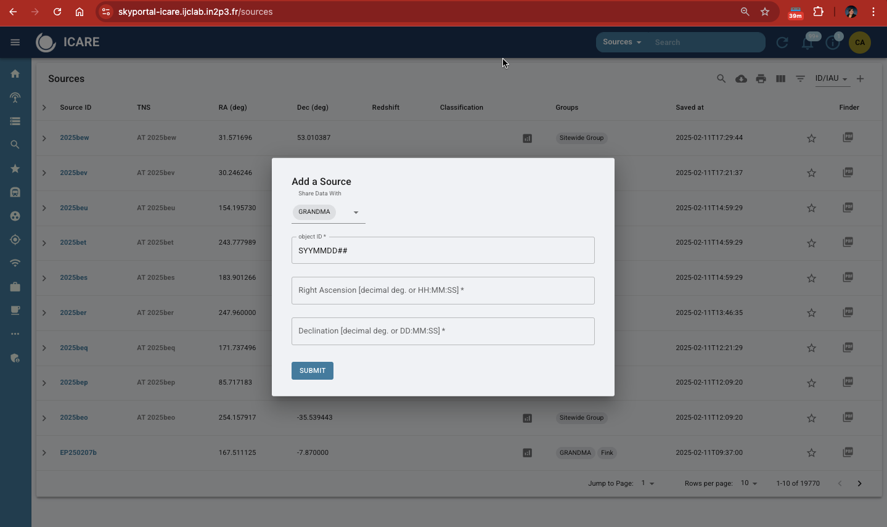

# 8. Skyportal: Creating Sources, Observation Plans and Uploading Photometry for Follow-up Advocates

## 8.1 Creating Sources
- **Step 1:** Navigate to the SkyPortal homepage.  
- **Step 2:** Go to Sources page. Click on the '+' sign in upper right hand corner and **"Add Source."**  
- **Step 3:** Enter the required details:  
   - **Object ID:** Provided in the GCN Circular or TNS.  
   - **Right Ascension (RA) and Declination (Dec):** Copy these values from the source information.  
- **Step 4:** Submit the source. Once added, the source will appear in the source list.

**IMPORTANT:** Make sure that the source you create is classified to "GRANDMA". 

### **8.1.1 Adding Classifications**
Classifications provide clarity on the status and priority of the source.

- Scroll to the **"Classifications"** section.  
- Select:  
   - **Group:** `GRANDMA`  
   - **Taxonomy:** `GRANDMA Campaign Source Observation 1.0`  
   - Choose classification tags: `Go GRANDMA`, `Stop GRANDMA`, `I Care`, `Not I Care`.  
- **Probability:** Set to `1` if the classification is certain.  
- Submit your classification.  

### **8.1.2 Adding and Removing Tags**
- To **add a tag**, click on the `+` button near the tags section underneath the source name and enter your desired tag (e.g., `I Care`).  
- To **remove a tag**, hover over it and click the trash bin icon. Confirm deletion.  

---

## 8.2 Observation Plans

### **8.2.1 Creating an Observation Plan**
- Go to the **"Follow-Up"** tab on the source page.  
- Select a telescope from the **GRANDMA network** (e.g., TAROT TCA, FRAM).  
- Configure observation details:  
   - **Filters**: Whether bessel or standard is specfic to the telescope and object you are viewing. See more on filters in **8.3**. 
   - **Exposure Time**  
   - **Exposure Count**  
Exposure time and count are variable. A default is usually 10 images by 300 second.
   - **Air Mass**: Use an air mass of 1.8 across all telescopes.
   - **Start and End Dates**: Do a two night range. It will give the telescope teams time to observe. 

- Submit the plan.  

### **8.2.2 Monitoring Observation Plans**
- View submitted plans on the source page.  
- Check the **Observability Map** for real-time telescope availability:  
   - **Yellow Telescopes:** Daytime  
   - **Blue Telescopes:** Nighttime  
- Prefer notifying telescopes at least two hours before nighttime.  

---

## 8.3 Uploading Photometry

Information about uploading photometry can be found in the data anlysis manual for STDWeb. However, here is some general information regarding filters within the GRANDMA system. 

Some filter systems are commonly associated with specific magnitude systems. For example:

SDSS filters (u’, g’, r’, i’, z’) are typically calibrated in the AB system.
Johnson-Cousins filters (e.g., U, B, V, R, I), also referred to as Bessel filters, are often calibrated in Vega magnitudes.
Many near-infrared filters (J, H, K from the 2MASS system) also use the Vega system.
Standard filters include UGRIZ. 

When a counterpart is detected, use the UVOT counterpart coordinates immediately, if available. If SWIFT UVOT does not detect a counterpart, use the coordinates from other telescopes detecting the counterpart. Update to the most accurate counterpart coordinates available, even if not provided by SWIFT/UVOT.

**General guidelines:**
- Use an air mass of 1.8 across all telescopes.
- If a gain is not specified, default to a value of 1, as gains may vary slightly across telescopes. If a gain is missing in the header and causes an inspection error, consult the telescope team for the correct gain.
- If the limiting magnitude (upper limit) is unknown, make an estimated guess and leave a note. The upper limit is not typically used if a magnitude and error are provided.
- Finally, include the coordinates used in the analysis file, especially if obtained from STDWeb, the telescope team, or a GCN notice. Do not wait to add data to the table if coordinates are missing; just ensure they’re added once available.

### **8.3.1 Force Photometry with ATLAS**

- Navigate to **"Observability"** and run force photometry for archival data.  
- Recommended search windows:  
   - **Short-Term:** Last 6 days  
   - **Long-Term:** Up to 1 year  
- Analyze the data:  
   - Look for detections pre-dating the gravitational wave event.  

