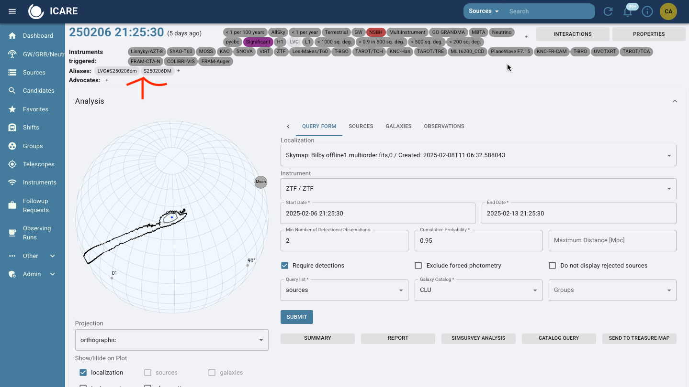
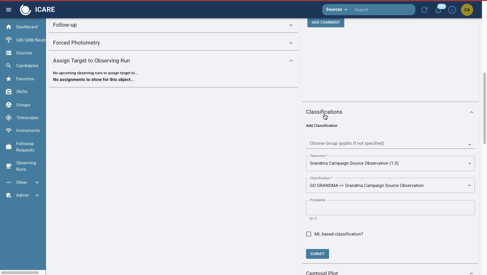
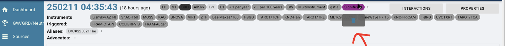
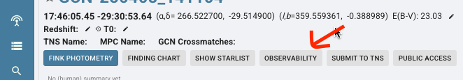
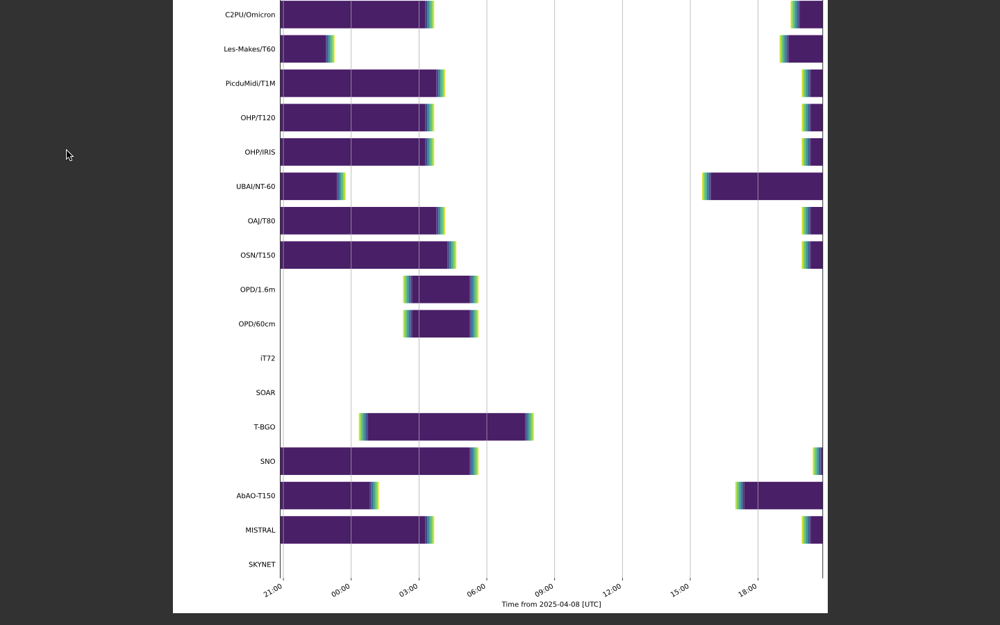
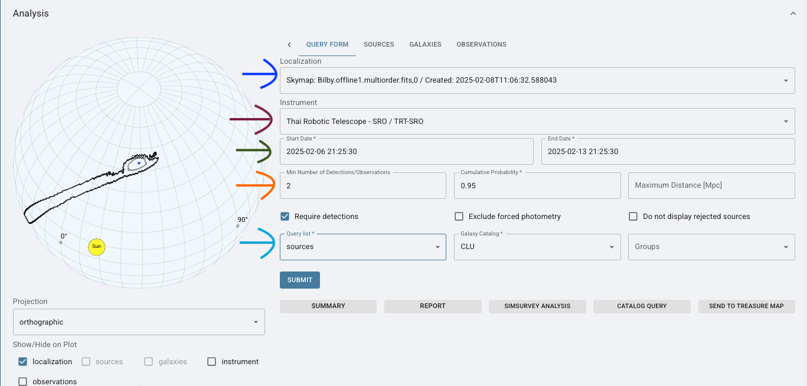
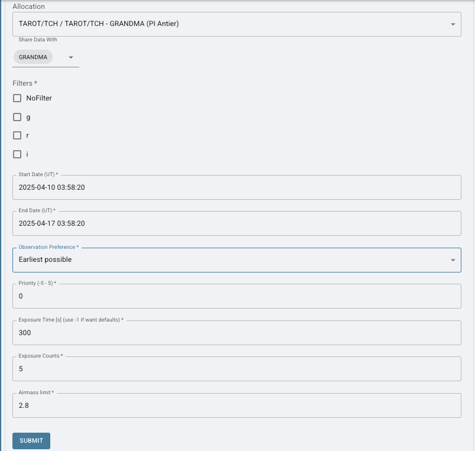
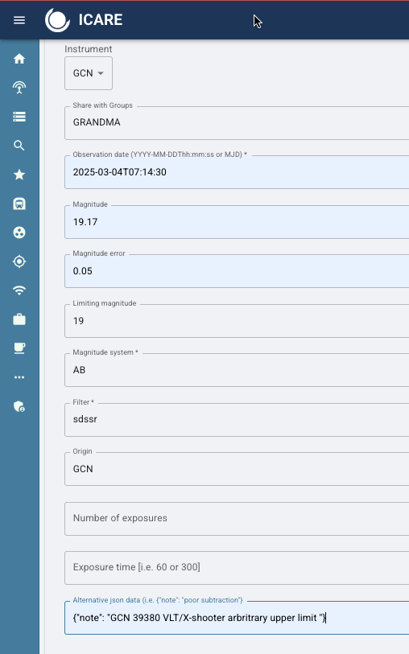

# 8. Skyportal: Creating Sources, Observation Plans and Uploading Photometry for Follow-up Advocates

## 8.1 Sources & Event Management
This section goes over what needs to be done in **SkyPortal** after you have determined an event is worth following up on. 

**First, we need to know the difference between a `GCN Event Page` and a `Source` Page.**

A GCN Event Page (which can be found in the 'GW/GRB/Neutrino' tab) is what is automatically generated and where you can create observation plans (learn more about Observation Plans in 8.2.2). We do not do science on this page. An example of this page is below. 



A source page is where all the science and activity occurs. Once you have it generated, you can find it in `Sources` in SkyPortal. 

### **8.1.1 Create a Source Page**

You create a `Source` page when you decide you are following up on an event.

- **Step 1:** Navigate to the SkyPortal homepage.  
- **Step 2:** Go to Sources page. Click on the '+' sign in upper right hand corner and **"Add Source."**  
- **Step 3:** Enter the required details:
   - **Shared with**: GRANDMA (unless you've been told to share to others, as well).    
   - **Object ID:** Provided in the GCN Circular or TNS. It could be a GRB (GRBYYMMDD) or a GW event (SYYMMDD##). 
   - **Right Ascension (RA) and Declination (Dec):** Copy these values from the source information.  
- **Step 4:** Submit the source. Once added, the source will appear in the source list.


**IMPORTANT:** Rarely, some GCN events automatically generate a source page. This occurs when an optical counterpart is indentified and it has been reported to the [Transient Network System (TNS)](https://www.wis-tns.org/). So, check the *sources* page to see if there are any events near T0 that could be associated with a GCN Circular or a GW alert. 

### **8.1.2 Adding Classifications**
Classifications provide clarity on the status and priority of the source. 

**Two cases when you handle classification:**

- When you have created a new source, add a classification. 

- When a new alert comes in through skyportal via email (either a GRB or GW event), check to see if a classification needs to be adjusted. Sometimes, events are labeled `Signifigant` and `GO GRANDMA` when they are not. These classifications will pop up on the header of each page and can be manually removed. You can see an example in 8.1.3.

- Scroll to the **"Classifications"** section.  
- Select:  
   - **Group:** `GRANDMA`  
   - **Taxonomy:** `GRANDMA Campaign Source Observation 1.0`  
   - Choose classification tags: `Go GRANDMA`, `Stop GRANDMA`, `Go GRANDMA (HIGH PRIORITY)`.
   - **Taxonomy:** `GRANDMA Campaign Source Classification 1.0`  
   - Choose classification tags: `Kilonova`, `Not Kilonova`, `GRB`, `Not GRB`, `GW Counterpart`, `Not GW Counterpart`, `GW Candidate`, `Not GW Candidate`, `Supernova`, `Not Supernova`, `I Care`, `Not I Care`.  
- **Probability:** Set to `1` if the classification is certain.  
- Submit your classification.

**NOTE** If observing/getting photometry after 24 hours: select `I-care`. **Short GRBs** and **Kilonvoa** are considered `GO GRANDMA (HIGH PRIORITY)`.



### **8.1.3 Adding and Removing Tags**
- To **add a tag**, click on the `+` button near the tags section underneath the source name and enter your desired tag (e.g., `I Care`).  
- To **remove a tag**, hover over it and click the trash bin icon. Confirm deletion.
  


### **8.1.4 Aliases & Candidates**

Aliases is the function on skyportal where you add your candidates or associated events. So, if we have a GW event, we make source pages for the event itself and for its potential optical candidates. We, then, add any of those possible sources or optical counterparts to the GCN Event Page, as seen in the example below.

Click the '+' Symbol and add the name of the associated event as it is found in SkyPortal "Sources" tab or as the transient is named in the GCN Circular (e.g., GRB######X) and this creates a link to the [**Gamma-ray Coordinates Network Viewer**](https://heasarc.gsfc.nasa.gov/wsgi-scripts/tach/gcn_v2/tach.wsgi/?event=S250206dm).


### **8.1.5 When do you update the coordinates in the source page?**

When a counterpart is detected, use the UVOT counterpart coordinates immediately, if available. If SWIFT/UVOT does not detect a counterpart, use the coordinates from other telescopes detecting the counterpart. Update to the most accurate counterpart coordinates available, even if not provided by SWIFT/UVOT. So, those with the smallest uncertainty in arcseconds. 

### **8.1.6 Summaries**

At the start of observations, make sure to add a summary to the source page. This is the template:

  > "The [Instrument/Telescope Name] triggered and located a [burst/astrophysical event] on [Date and UTC Time] (T0). Shortly after, [Follow-up Telescope/Instrument] identified an optical counterpart with a candidate located at RA=[Right Ascension], DEC=[Declination]. Approximately [Time] after T0, it was observed at [Magnitude] in the [Filter/Band]. Subsequent observations by [Observing Group/Consortium] using [Telescope(s) involved in the follow-up] detected the source approximately [Time post-T0], reaching a magnitude of [Magnitude or reporting an upper limit] in the [Filter/Band]. Observations were [noted limitations, such as affected by moonlight or poor weather conditions]."
   
If it has been determined, document the redshift measurement and if spectroscopy has been performed in the summary and comments. Make sure to include in the summary and update the source itself. Record the source of this information.

As observations continue, make sure to update the summary with who has had uploaded images, and the magnitudes/errors, and limits those images provide. Include if a candidate has been found.

As optical counterparts (candidates) are found, updates the coordinates on the source page accordingly. Notify #observations, skyportal comments, and your team. Make sure to include the GCN source of these coordinates. 

---

## 8.2 Observability, Observation Plans and Follow-Up Requests

### 8.2.1 Observability 

An observability plot shows which telescopes in a network can observe a target over time. This tool is used to plan follow-up observations by helping you identify which telescopes are currently available or will become available soon, when the target is visible at each site, and which stations are best suited for submitting observation requests. This plot will update as time progresses. Make sure to produce a new plot for each shift. 

The `Observability` plot can be produced by clicking on the icon located on the Source page of an event. Click 'PDF' and it will download automatically. 



How do you determine who can observe from this plot? 



1. **Axes**

- **Y-Axis (Vertical):**  
  Lists all available telescopes in the network (e.g., TAROT/TCA, KAIT, GTC, etc.).  
  Each row corresponds to one telescope.

- **X-Axis (Horizontal):**  
  Represents time, typically starting from the current UTC time at the origin (the leftmost edge).  
  Time advances to the right in hour intervals, labeled by UTC hour (e.g., 00:00, 03:00, 06:00...).

2. **Bars or Shaded Regions**
- These indicate when a telescope has the target above the horizon and can observe it.
- The length of the bar shows how long the target is visible.
- If colors are used:  
  - **Purple** indicates good visibility.  
  - **Gradients** indicate twilight or dawn.

### **8.2.2 Creating an Observation Plan**

Follow-Up Advocates (or Shifters) will not need to generate Observation Plans. But, it is an important aspect of SkyPortal to familiarize yourself with in the event a telescope operator requests you to generate them. 

For **GW events**, Observation Plans are generated automatically and then uploaded to **OwnCloud** in a file labeled `GWEMOPT`. 
For **GRBs**, no observation plans are automatically generated for GRBs as precise coordinates are usually provided. This means that an **OwnCloud** file needs to be created for an event to store images. 

Observation Plan generation has a few different primary features which I will go over below: 

**Select a Localization Map (blue/first arrow):**
Choose a skymap (e.g., Bilby.offline1.multiorder.fits) from a gravitational wave alert to define the sky region to target.

**Choose an Instrument (purple/second arrow):**
Select your telescope (e.g., Thai Robotic Telescope – TRT-SRO) that will perform the observations.

**Set Observation Dates (green/third arrow):**
Define the start and end times for the observation window, ensuring they align with visibility constraints and urgency.

**Set Detection Criteria (orange/fourth arrow):**
Enter the minimum number of required detections (e.g., 2) and cumulative probability coverage (e.g., 0.95) to prioritize high-confidence regions.

**Select Query List and Galaxy Catalog (light blue/fifth arrow):**
Use the sources query list and a galaxy catalog (e.g., CLU) to match potential host galaxies within the localization.

**Submit:** Press SUBMIT to generate the observation plan. The system will compute the optimal targets within your selected skymap region, date range, and detection criteria.




### **8.2.3 Submitting a Follow-Up Request**

Follow-up requests are generated when we wish to **automatically trigger a robotic telescope** to observe a transient. After submitting a request, please ensure you **contact a member of the associated telescope team**. 

Currently, we support robotic follow-up requests for the following instruments:  
**TAROT, TRT, AbAO, UBAI, OPD**.  

**Note:** Only **TAROT** supports *fully robotic* triggering without the need to contact the telescope PI.

### How to Submit a Follow-Up Request

1. **Navigate to the Source Page**  
   Go to the event’s source page in SkyPortal and click the **“Follow-Up”** tab.

2. **Select an Instrument or Allocation**  
   Choose a telescope from the **GRANDMA network** (e.g., *TAROT-TCA*, *FRAM*, etc.).  
   Ensure you select a **station that can observe the target** based on the observability plot.

3. **Share Data with GRANDMA**  
   Tick the option to **share the request and resulting data with the GRANDMA collaboration**.

4. **Configure Observation Details**
   - **Filters**  
     Select filters based on the **evolutionary stage of the transient** and **instrument availability**. For example:
     - Early-stage kilonovae: prioritize **blue or UV filters** (`u`, `g`)
     - Later stages: consider **redder filters** (`i`, `z`, `Y`)

   - **Exposure Time** and **Number of Exposures**  
     These should reflect the **brightness of the target** at the time of the request.  
     > As a general guide:  
     > - For fainter sources (e.g., mag > 20), increase both exposure time and count.  
     > - For brighter sources (mag ~17–18), shorter exposures may suffice.  
     If unsure, consult recent photometry on the source page.

   - **Air Mass**  
     Leave this field at the default setting unless instructed otherwise.

   - **Start and End Dates**  
     Request a **two-night observation window** to allow flexibility for the telescope team.



**Important Notes for Shifters**

Maintaining **accurate and up-to-date photometry** on SkyPortal is critical. Shifters rely on this information to responsibly determine if a follow-up is needed. Please do not let a shift pass without:

- Uploading all processed images and synthesize them when possible.
- Attach relevant GCN circulars to the photometry table.
- Use this data to judge whether continued observation in a specific filter is scientifically justified.

> **Science tip:**  
> Kilonovae typically **rise in the blue/UV bands** and **fade in the red/NIR**. Monitoring their evolution with the appropriate filters helps confirm their nature.

### **8.2.4 Monitoring Observation Plans**
- View submitted plans on the source page.  
- Check the **Observability Map** for real-time telescope availability:  
   - **Yellow Telescopes:** Daytime  
   - **Blue Telescopes:** Nighttime  
- Prefer notifying telescopes at least two hours before nighttime.  

---

## 8.3 Uploading Photometry

Photometry must be uploaded to SkyPortal to track and visualize the transient's brightness evolution. This can be done in one of two ways:

1. By **synthesizing images** from telescope teams via STDWeb.
2. By **uploading photometry from GCN Circulars**, which typically provide magnitudes, magnitude errors, and upper limits.

Details on synthesizing images are available in the **STDWeb Data Analysis Manual**.

Below is a general guide to filters and magnitude systems used within the GRANDMA network:

- **SDSS filters** (`u'`, `g'`, `r'`, `i'`, `z'`) → usually calibrated in the **AB magnitude system**.
- **Johnson-Cousins filters** (`U`, `B`, `V`, `R`, `I`, also known as Bessel filters) → usually in **Vega magnitudes**.
- **Near-infrared filters** (`J`, `H`, `K` from the 2MASS system) → typically in the **Vega system**.

### 8.3.1 Uploading Photometry from GCN Circulars

To manually add photometry from a GCN:

1. Navigate to the **Photometry** section on the event’s **source page**. This is where the light curve (magnitude vs. time) is displayed.
2. Click **“Upload Photometry”**, then choose **“Using Form (One)”**.
3. Fill out the form carefully to ensure clean light curve visualization. Refer to the example provided and the instructions below: 

4. **Instrument**:
   - If the instrument listed in the GCN is available in SkyPortal (e.g., `SWIFT/UVOT`), select it.
   - If the instrument is not listed, select **`GCN`** from the dropdown.
5. **Share data with GRANDMA** (unless instructed otherwise).
6. **Observation date**: This is when the observation began. GCNs may provide it in MJD format—convert it to UTC as needed.
7. **Magnitude** and **magnitude error**: Enter these directly from the GCN.
8. **Limiting magnitude (upper limit)**:
   - If only an upper limit is available, round it to the nearest magnitude and include the phrase `"arbitrary upper limit"` in the alternate data input.
   - If both magnitude and error are given, do not input an upper limit.
9. **Magnitude system**: If not explicitly stated, infer it using the filter system:
   - `SDSS` → AB system
   - `Johnson/Bessel` or `2MASS` → Vega system
10. **Filter**:
    - GCNs often list filters like `r=19.9`. For this, use `sdssr` as the filter value.
11. **Origin**: Always enter `"GCN"` — **do not add any additional text**.
12. **Exposure time and count**: If provided, include them.
13. **Alternative JSON Data**:
    - Format exactly as:
      ```json
      {"note": "GCN 39380 VLT/X-shooter arbitrary upper limit"}
      ```
    - If the upper limit is **not** arbitrary, omit that part:
      ```json
      {"note": "GCN 39380 VLT/X-shooter"}
      ```
    - Important: Use **straight double quotes (`" "`) only**. Avoid copying from external documents where curly quotes may be introduced, as these will cause errors.

> **Warning:** The alternate data input is highly sensitive to formatting. Always double-check your quotes and JSON syntax before submitting.

### **8.3.2 Force Photometry with ATLAS**

- Navigate to **"Observability"** and run force photometry for archival data.  
- Recommended search windows:  
   - **Short-Term:** Last 6 days  
   - **Long-Term:** Up to 1 year  
- Analyze the data:  
   - Look for detections pre-dating the gravitational wave event.  


