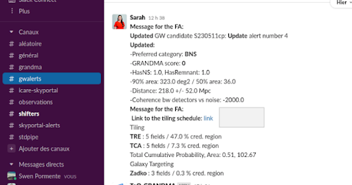
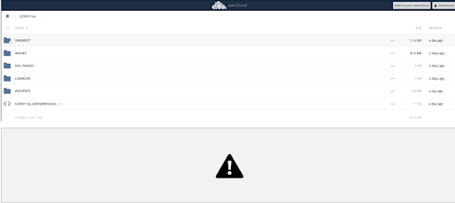
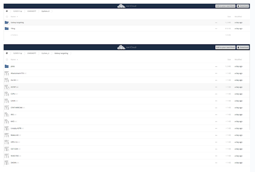
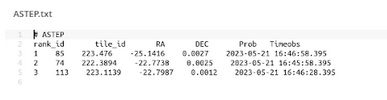
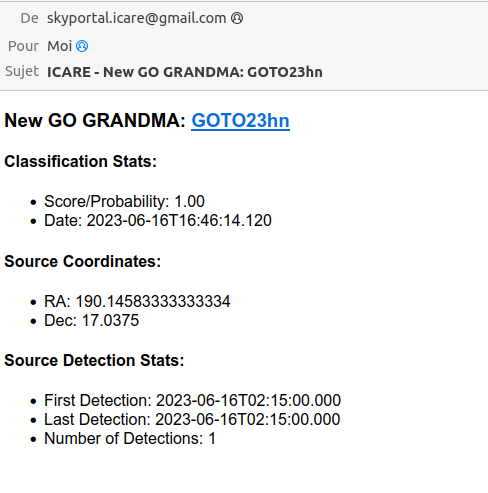
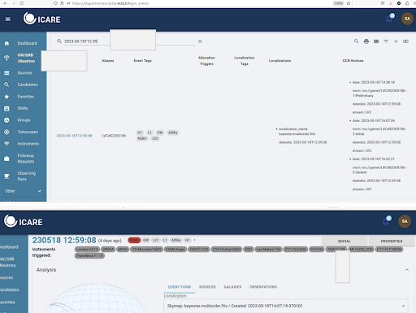

# 7. Get the Observation Plan (Only for Telescope Teams)

## 7.1 Retrieve Your Data Promptly After a GW Alert

1. **Notification**:
   - You received a notification of a GW alert on Slack (#gwalerts).
  



2. **Access the Data**:
   - Click on the link in the notification to go to OwnCloud. You will be directed to the page of the source (e.g., S230511cp).

3. **Navigate to the Relevant Folder**:
   - Go to the folder `GWEMOPT`:
     - If the "Update" folder exists, go there.
     - Otherwise, go to "Preliminary".
   - Then, navigate to `Galaxy targeting/Tiling` (use "Tiling" for bigger aperture telescopes).
  


4. **Find Your Telescope**:
   - Locate your telescope in the `Galaxy targeting` folder (or in `Tiling` if not in `Galaxy targeting`).

   - Example: For ASTEP, find the file `Name_of_your_telescope.txt`.

     - The file contains tiles to observe, with the first tile being the most likely to find the source.
     - Be cautious as column names and numbers might not be well aligned.
     - The file includes the tile ID, RA and DEC coordinates, probability, and times in UTC.

## 7.2 Retrieve Data for Follow-Up

1. **Follow-Up Advocate Query**:
   - When the follow-up advocate flags a source as GO GRANDMA, you will receive an email indicating that you need to follow up.
  



## 7.3 Notify the Follow-Up Advocate

1. **Inform GRANDMA**:
   - Once you have the information and are ready to observe, notify the rest of GRANDMA:
     - Post in #observations on Slack.
     - Contact the individual on shift or the weekly coordinator. This information will be evident in #Shifters.

## 7.4 Reporting Observations

1. **On Slack (#observations)**:
   - Write a message to inform about your observations:
     ```markdown
     I received the plan and I will start observing with {Name_of_your_telescope_id} id {the one you are observing} tile id {tile_id} RA {RA} DEC {DEC} probability {probability} on preliminary/update date {date}
     ```
   - Example message if observing the first tile in `ASTEP.txt`:
     ```markdown
     I received the plan and I will start observing with ASTEP id 1 tile id 55 ra 221.338200 dec 23.809400 probability 0.003400 on preliminary date 2023-05-22T16-56-43
     ```

2. **Update ICARE**:
   - Search for the event in ICARE:
  


     - Go to `GW/GRB/Neutrino` and use the source date to search for it on the site.
