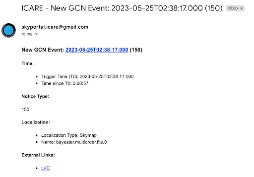

## Summary: A GW Alert Has Been Received!

### Via Email or Slack (#gwalerts):

1. **Check Event Type**:
   - Click on the external link provided to check the event type.
   - Look for the same parameters discussed in training:
     - Preferred event type (BNS, BHNS)
     - 90% and 50% localizations (less than 200 deg²)
     - Distance (less than 200 Mpc)

2. **If the Alert Meets Criteria**:
   - If it is a BHNS/BNS event and meets one of the criteria for 90%, 50%, or distance, we have the scope to observe it.
   - Notify the #observations channel on Slack with the message:  
     `"New alert: name of alert; list of parameters. We will now wait for the observation plan to be created."`

3. **Wait for Observation Plan**:
   - Go to OwnCloud and wait for an observation plan to be created.
   - Check if an observation plan has been created by following these steps:  
     `GW > Name of alert > GWEMOPT > Preliminary alert > Tiling/Galaxy targeting`
   - Once the plan is created, update the #observations channel.

4. **Notify Telescope Teams**:
   - Go to SkyPortal and follow the instructions from the cookbook starting at “Notifying Telescopes.”
   - Update responses using the template both with your team mates and in the #observation channel. 

