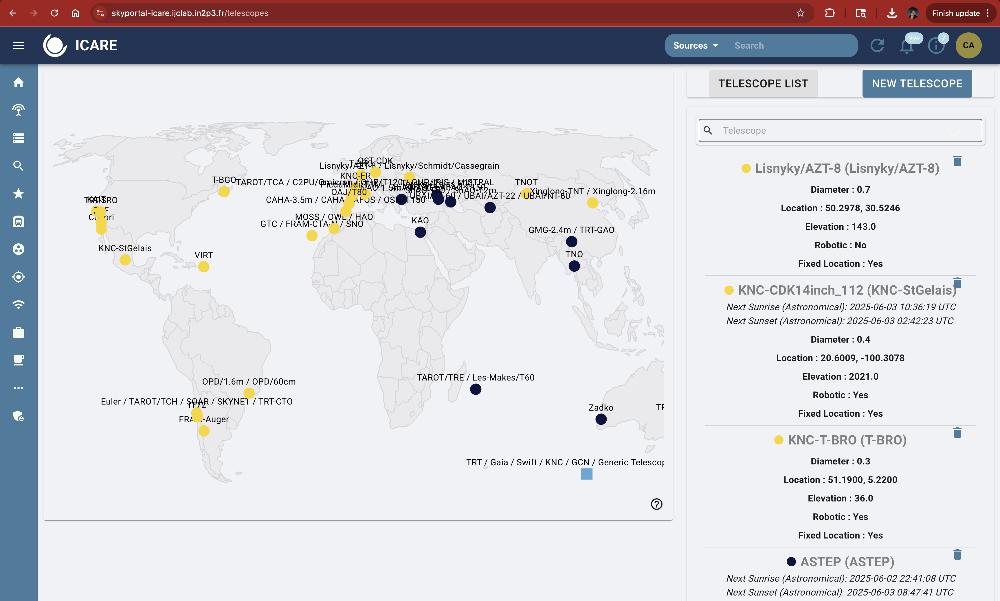

# Triggering Telescopes as a Follow-Up Advocate (Shifter)

## Observability & Beyond! 

When planning follow-up, it’s important to select telescopes based not only on when it is night at their location, but also on whether they can **observe the transient at the required depth**.

Observability (see Section 9.2.1) helps you determine **which telescopes are in darkness and when**. However, it does **not** tell you:
> - Whether a telescope is **sensitive enough** to reach the target magnitude,
> - How many images you should request,
> - What **exposure time** is needed to detect or constrain the event.

This table helps fill that gap by providing detailed capabilites and usage limits of telescopes within GRANDMA's network. 

Use it as a guide to determine what class of telescope is appropriate for the science goal (such as early GRB afterglow, faint kilonova, deep non-detection).

---

## Usage Levels of Telescopes

The telescopes in GRANDMA are operating in various ways and are to be solicited by the FAs differently based on the observing scenario. 

| Code | Usage Frequency          | Notes                                    |
| ---- | ------------------------ | ---------------------------------------- |
| VF   | Very Frequent (\~3h/day) | Fully integrated, can be triggered often |
| O    | Occasional (\~1/month)   | Use judiciously                          |
| R    | Rare (<1/3 months)       | Reserve for high-interest events         |
| VR   | Very Rare (<1/6 months)  | Use only for high-priority cases         |
| nOP  | Not Operational          | Currently inactive or unavailable        |

---

## Telescope teams

TAROT team: A. Klotz (IRAP), S. Antier (OCA/IJCLAB), Q. André,  A. Dupin, C. Limonta (OCA)

AbAO Team: V. Aivazyan (AbAO), R. Inasaridze (AbAO), N. Kochiashvili (AbAO)

KAO Team: M. Abdelkareem (NRIAG), Y. Hendy (NRIAG), A. Takey (NRIAG)

FRAM-Auger Team: M. Jelínek (ASU), S. Karpov (FZU), M. Mašek (FZU)

AST3-3 and YAHPT Team: J. Chen, A.V. Filippenko, J.J. Geng, Y.L. Hua, X.Y. Li, T.R. Sun, W. Zheng

OHP/MISTRAL Team: C. Adami, E. Bernaud, S. Boissier, C. Dubois, W. Mercier, A. Saccardi (GEPI)

NAO Team: B.M. Mihov (NAO), L. Slavcheva-Mihova (NAO)

Skynet Team: D. Dutton (UNC), D. Reichart (UNC), D. Schlekat (UNC)

OST: R. Hainic, F. Rünger (UnP)

## A. Prompt Response - Automatic / Semi-Automatic Triggering

### Asia Time Zone Semi-automatic

| Telescope               | Aperture | Filters      | Nominal upper limit | Trigger Type | Observational Rate | Contact / Notes |
|-------------------------|----------|--------------|-----------|--------------|--------------------|-----------------|
| TAROT/TNC (NC)          | 0.18m    | no filter    | 17 max       | Automatic    | Not Operational      | Will be operational in July 2025, **FA** contact: A. Klotz (aklotz@irap.omp.eu) |
| TAROT/TRE (La Réunion)  | 0.2m     | no filter    | 19 max       | Automatic    | Very Frequent      | Slack @Sarah to check if images are taken and online analysis for triggering. Images are taken automatically for GRB/SWIFT/Fermi, but the current status is not reported in Skyportal (thus, contact Sarah). For SVOM events, you can trigger via Skyportal, for example in 10x180s in 'Clear' in the first hour (based on the gamma-ray or x-ray localisation), but normally it is done automatically by Skyportal itself (but needs some checks) |
| Les Makes-60            | 0.6m     | gr (TBC)     | 20 mag in 6x120s and 21-21.5 in 30 min       | Semi-auto    | Occasional         | Email for observations: frederic.vachier@obspm.fr and A. Klotz (aklotz@irap.omp.eu, available from 18h to 22h for prompt observations, images: ask A. Klotz to upload, analysis by DAG. |
| TRT/GAO (China)         | 0.8m     | TBC          | TBC       | Semi-auto    | Very Rare        | Trigger via Skyportal by **FA**; ask Aom (manasanun_t@cmu.ac.th) by email or Slack (@Aom), check in Skyportal the measurements or recontact Aom to upload results. You can perform revisits on the telescopes as it is reaching a good sensitivity. Sometimes you are asking for a certain number of images, but you do not have the time allocation|
| TRT/SBO (Australia)     | 0.8m     | Johnson      | 20 mag in B and I in 30 min, 21.8 mag in R and V in 30 min      | Semi-auto    | Frequent        | Same Process as TRT/GAO |

### Europe Time Zone Semi-automatic

| Telescope               | Aperture | Filters    | Mag Limit | Trigger Type    | Observational Rate         | Contact / Notes |
|-------------------------|----------|------------|-----------|-----------------|----------------------------|-----------------|
| FRAM/CTA-N (La Palma)   | 0.25m    | RI         | 17 in a couple of min      | Automatic        | Very Frequent               | GRB/Swift program is automatic (requires agreement if we have some publication planned) --> Contact @Mašek on Slack if interested. For SVOM, contact @Sergey Karpov or @Mašek via Slack (no need to specify exposure details). Check with @Mašek if results are uploaded to Skyportal, as the analysis is performed by Martin |
| TAROT/TCA (France)      | 0.25m    | gri        | 19 in 30 min, 16-17 for 60s       | Automatic        | Very Frequent               | Follow same instructions as TAROT/TRE. |
| OHP/IRiS (France)       | 0.5m     | ugriz      | 19 mag in couple of min       | Semi-Automatic   | Not operational for GRANDMA yet | Possible to trigger but no analysis will be performed (images in raw mode). To trigger, ask via Mattermost  S. Basa (https://mattermost.osupytheas.fr). Contacts: S. Basa, Jean-Grégoire Ducoin, Francesco Magnani, Sarah Antier, Dahlia Akl (they have access and can act as intermediaries), or contact Stéphane Basa directly (stephane.basa@lam.fr) @stéphanebasa. |
| Abastumani-T150 (Georgia)| 1.5m    | ugriz        | 21 mag 10 min, 22.5 in 1      | Semi-auto but currently manual    | Rare          | Request to @Nino for observations, and check on measurements reports by Nino on SP, the automatic system is not operational |

### America Time Zone

| Telescope                | Aperture | Filters       | Mag Limit                   | Trigger Type   | Observational Rate | Contact / Notes |
|--------------------------|----------|---------------|----------------------------|----------------|--------------------|-----------------|
| FRAM/Auger (Argentina)   | 0.3m     | Clear, RI     | 17 mag nominally            | Automatic      | Very Frequent      | Same process as FRAM/CTA-N. |
| TAROT/TCH (Chile)        | 0.25m    | gri           | g, r, i: < 180s (18–19 mag), > 30 min (20 mag) | Automatic (fastest) | Very Frequent      | Same process as TRT/GAO. |
| VIRT (USA)               | 0.5m     | ugriz         | 19 mag in 1 min (tentative) | Automatic?     | Occasional         | Should be automatic once Bruce has repaired (expected September 2025). Current process: contact @Priya Gokuldass via Slack or email (priyadass.94@gmail.com) or Bruce Gendre (bruce.gendre@uvi.edu) for triggering. Do not hesitate to perform revisits. The team requests to be notified for prompt scheduling observations between **10h UTC and 04h UTC**. |
| TRT/SRO (USA)            | 0.8m     | RV            | 21 mag in R and V in 50 min                         | Semi-auto      | Frequent           | Same process as TRT/GAO. |
| TRT/CTO (Chile)            | 0.8m     | griBVR            | 14x600s 22.1 in r-band, 11x300s 22.3  in V                      | Semi-auto      | Frequent           | Same process as TRT/GAO. A new telescope that joined the network|

---

## B. Regular Telescopes (by contact for observations via FAs)

### Asia Time Zone

| Telescope          | Aperture | Filters    | Mag Limit | Observational rate    | Contact / Notes |
|--------------------|---------|------------|-----------|--------------|-----------------|
| TNT (China)        | 0.8m    | BVRI       | 20        | Occasional    | WeChat via "Kilonova catcher & GRB catcher project" / or if you don't have access to wechat, email Xiaofeng Wang <wang_xf@tsinghua.edu.cn>, the telescope is not automatic and some night are not allocated to TSU's group. Trigger this team only is a well localized optical counterpart is found and the first night post T0, since the obs are quite shallow. It is not necessary to trigger this telescope for SVOM GRBs as the time of the telescope is allocated directly to the SVOM team for it. Provinding the up to date upper limit is enough for this team. Don't hesitate to ask all colors possible|
| SHAO/T60 (Azerbaijan)| 0.6m    | UBVRI      | 19 max, 18 mag in 10 min        | Very Rare    | The telescope is shared by multiple groups. The GRANDMA team is not necessary at the site of the telescope. The best way of contact is either @Zumrud or @Shabnam via slack, either Nariman Ismayilov <ismailovnshao@gmail.com> by email, the stacking is not necessarily done by the team but the team can provide results via skyportal. The FA can ask sistematically observations to the team, if the source is quite bright (first night)|
| UBAI-NT/ST (Uzbekistan)| 0.6m    | UBVRI      | up to 20 mag in 10 min in R band  | Frequent     | Periodic closure at Winter (from XX to XX), 45 min everynight for GRANDMA so you can ask systematically via slack @Yodgor and @Otabek Burkhonov. There is a period when the observatory is closed |
| Abastumani-T70 (Georgia)| 0.7m    | UBVR       | 10 min in R around 20 and 21.5 mag in 90 min      | Frequent     |   Ask @nino from Slack or by email Nino Kochiashvili <nino.kochiashvili@iliauni.edu.ge> or Raguli Inasaridze <raguli.inasaridze@iliauni.edu.ge>, the I filter is not working. The team can adjust observations based on upper limit asked, and the team will report directly the measurements in Skyportal (no need to analyse the data)|
| GMG-2m (China)     | 2.0m    | UBVR/griz    | 21.5  max (with spectra 19 mag)  | Occasional   | Contact Jirong Mao <jirongmao@mail.ynao.ac.cn> contact by chat or by email on GRB/Swift/Fermi (but not for SVOM, it is under the SVOM time). Sometimes the data won't be necesarly shared with GRANDMA, but it is good to systematically asking and the revisits  |
| Xinglong-2.16 (China)| 2.16m   | UBVR/griz ?    | 20.5 max (with spectra 18 mag)    | Rare         | Detection only !!, email Xiaofeng Wang wang_xf@tsinghua.edu.cn, the telescope is not automatic and some night are not allocated to TSU's group. You can ask multiple colors. The data will be in charge by the GRANDMA/DAG or ask Haowei Peng for reducting the data and upload it in Skyportal|

### Europe Time Zone

| Telescope          | Aperture | Filters    | Mag Limit | Frequency    | Contact / Notes |
|--------------------|---------|------------|-----------|--------------|-----------------|
| ASO (Morocco)      | 50cm | BGRI       | 21.5 in R max     | Frequent to Very Frequent     | Whats App Ali (+212 661141372) or aziz5200@live.com, the telescope is semi-automatic run by a prefessional amateur, the FA should provide strict guidance with exposure, filter, and number of images, position. Aziz does not have access to skyportal. Maybe a standard is 20x180s in R and I and propose revisits    |
| HAO1 (Morocco)      | 30cm | BGRI       | 19.5 mag     | Frequent to Very Frequent     | Same as ASO   |
| KAO (Europe)      | 2m      | griz      | 21.5/22.0 mag in r (45 min),       | Frequent     | Contact Mona or Eslam via Slack. The team knows how to reduce the data and imported in Skyportal, if no response, contact Ali Takey <ali.takey@nriag.sci.eg>  |
| Pic du Midi  (France)      | 1m      | gri + IR   | 22.5      | Rare | **Late time obs (not request obs in advanced for measurements in couple of days)**. The team is formally in GRANDMA. The team is not present on site, the level of success rate is quite low. Once observations are performed, the team is awake during the night. For these reasons, the observations must be highly valuable (as for short GRBs) or part of a publications (late time). So the process is that the WC coordiator contacts Colas Francois <Francois.Colas@obspm.fr>, to understand if there is someone at the site to observe the target. Do not wait too long, as sometimes a trip to Pic du Midi is planed for the coming days, so the process would be better to ask when the source is still bright and **interesting**, if someone plan to be on site in the coming days and propose different epoch of observations as C2PU (a road map for a week). The data are compiled by A. Klotz and posted in owncloud. The DAG can performed its analysis. A GCN can be sent but not necessary |

### America Time Zone

| Telescope          | Aperture | Filters    | Mag Limit | Frequency    | Contact / Notes |
|--------------------|---------|------------|-----------|--------------|-----------------|
| OPD (Brazil)       | 0.6m ?    | RV ?          | 22 mag in 1h for sure      | Occasional     | Wagner by email for sure WAGNER CORRADI <wbcorradi@lna.br>, by slack @nelio sasaki is a good contact for observations. The team has access to fully to the telescope or not, so it is very better to ask long term observations WHEN it is Needed, so when it is a confirmed candidate. You can ask revisits but only if you receive previous results of detection from the team. The team is currently exercising on the analysis, the DAG must finish their traning so that they can upload their results directly in skyportal|

---

## C. Telescopes with Specific Contact

### Asia + Europe + America Time Zones

| Telescope          | Aperture | Filters    | Mag Limit |Frequency| Contact / Notes |
|--------------------|---------|------------|-----------|---------|-------|
| KNC                | From 15 cm to 50 cm | BVRI, griz, Green    | 15 to 20        | very frequent| **KNC** is GRANDMA’s amateur network, coordinated via Slack and [kilonovacatcher.in2p3.fr](http://kilonovacatcher.in2p3.fr/). Amateurs receive GRB alerts automatically but need to be contacted manually when GRANDMA chooses to observe a particular alert. When GRANDMA is observing, the role of the FA is to contact TURPIN Damien <damien.turpin@cea.fr> and Cristina Andrade <andra104@umn.edu>,  who manage KNC participation and coordination. Share relevant localization information, this can be done in #observations. **Cristina Andrade** and **Damien Turpin** track which amateurs respond and whether observations are submitted. They also verify observation timing and appropriateness for the target. It is the responsibility of the FA to follow up with **Cristina Andrade** and **Damien Turpin** about if the images were uploaded directly to OwnCloud or the KNC website. Amateur astronomers do not perform photometry. We must consider the observations for GCN production. **Damien Turpin** is primarily responsible for extracting photometric measurements from KNC images. In some cases, members of the DAG (Data Analysis Group) assist. **Cristina Andrade** typically compiles the photometric results and uploads measurements to SkyPortal, referencing the contributing amateur(s) in the comment or annotation. Shifters do not upload KNC results to SkyPortal unless explicitly delegated.|
| Skynet             | From 15 cm to 50 cm | BVRI, griz, Green    | 19        | very frequent if go| dschlekat@unc.edu  (very motivated graduate) and dan.reichart@gmail.com (PI). The collaboration is running independantly outside of GRANDMA for triggering observations. The GRB chair or the corresponding coordinator or dahliaaql01@gmail.com <dahliaaql01@gmail.com> can contact them for collaboration usually post observations, after it is approved by the GRB chair |

### Asia Time Zone

| Telescope          | Aperture | Filters    | Mag Limit |Frequency| Contact / Notes |
|--------------------|---------|------------|-----------|---------|-------|
| ASTEP (Antarctica) | 50cm    | Red/Blue simultaneous   | 20 mag         | Rare        | It should be used with care, as only for very southern targets. To initiate observations, the shifter must make a proposal to the weekly coordinator, and the WC will contact sarah.antier@oca.eu to propose the observation (RA, DEC, magnitude limit in R). We can observe long periods (Tristan is the principal coordinator). The data will be analyzed by S.Antier and uploaded to owncliyd. After that, the DAG must perform the measurements. |
| YAPTH (China) | 80cm | griz  (?)       | 22.5 max ?       | Frequent | The telescope is a partner of GRANDMA. You can write an email with justification of why it is important to observe, you can provide the coordinates and the expected magnitude in different filters. The data are not uploaded in owncloud and are transmitted by email. The team usually provides independant measurement. The contact is trsun@pmo.ac.cn |
| AST3-3 (China) | 50cm | g         | 21        | Frequent | The telescope is a partner of GRANDMA. You can write an email with justification of why it is important to observe, you can provide the coordinates and the expected magnitude in different filters. The data are not uploaded in owncloud and are transmitted by email. The team usually provides independant measurement. The contact is trsun@pmo.ac.cn|

### Europe Time Zone

| Telescope          | Aperture | Filters    | Mag Limit | Contact | Notes |
|--------------------|---------|------------|-----------|---------|-------|
| C2PU (France)      | 1m      | griz        | 22.5      | Rare | Late time obs (not dot request before the source reached 21.5 mag magnitude). The telescope is shared between amateur and professional astronomers, and at times, the wide-field imager may not be mounted. Once validated by the WC, the WC can contact the amateur astronomer Serge Brunier (serge.brunier@wanadoo.fr, cc S. Antier) to request observations — but only if the data **will be in publications** (not for alerts). The observation proposal should be flexible, offering several possible periods. For example: "Would you be available to observe tomorrow at XX magnitude using [suggested exposure time] and [number of images]?" You can also propose alternative days (e.g., in two days) and vary the filters in one single proposal. The proposal should avoid being too direct, more in the form of collaboration. Serge must has the validation to operate from the PI J-P Rivet. Once observations are completed, the team must reach out to the amateur to obtain the raw data for analysis offline.  |
| SPECULOS/ARTEMIS (Canaria Islands)  | Unknown | grz        | 23.5  | Rare    | Late time obs. The contact with the team goes trough the GRB chair or the PI. The telescopes is only activated in case of publication as the project is oriented on exoplanet and very limited time is devoted to another project. We ask to the FA and WC to make a proposal to the GRB chair and PI with multiple period proposals|
| NAO-2m (Bulgaria)  | 2m      | Unknown    | 23        | Email PI |
| GTC                | 10.4m   | griz       | 25        | Antonio / Feli |

### America Time Zone

| Telescope          | Aperture | Filters    | Mag Limit | Contact | Notes |
|--------------------|---------|------------|-----------|---------|-------|
| Euler (Chile)      | 1m      | griR (?)   | 23.4      | Email Frederic Dux |
| SPECULOS/Something | Unknown | grz        | 23.5      | Email Sarah / Marion |
| CFHT               | 3.6m    | griz       | 25        | PI Sarah Antier |

---

## D. Telescopes with Unknown Status

### Asia Time Zone

| Telescope          | Notes |
|--------------------|-------|
| Zadko (Australia)  | Possibly not working anymore |
| AZT-8 Lisnyky      | The contact is Alexander Baransky <abaransky@ukr.net> but the team is facing large issues due to the war |
| Shao/2M            | Altough mentionned in the GRANDMA list, we never obtained images from the telescopes |
| New UBAI Telescope 1m | Planned next year, waiting from feedback from Yusuf  |
| SNOVA              | Replaced by TNOT, not functionning anymore |
| Ali-50             | The telescope is broken and the team does not have access, another telescope has been in operation in Tibet by the TSU team |
| KANATA|  1.5-m, B, V, R, I, z'. The contact is from A. Takey. We never operate with this group but they are thrilled to collaborate. In case of a good target but not necessarly for publication, the WC (after validation of the GRB chair or the PI) can send a request to Kawabata <kawabtkj@hiroshima-u.ac.jp> in a form a very kind email for exemple : zwe have a very nice source XX going with 13:14:42.42 +05:01:50.27 / (α,δ= 198.676730,  5.030630) (l,b=318.045334,  67.217086). And for private info (pls do not share) the source is still bright and must be around 21/21.5 mag in couple of hours. Would you be in position to trigger yoru telescopes and observe it pls ? this weekend and monday ?|

### Europe Time Zone

| Telescope          | Notes |
|--------------------|-------|
| OAJ-T80 (Spain)    | Need Spanish partner |
| OHP-T120 (France)  | Possible via MISTRAL collaboration |
| OSN-T120 (Spain)   | No recent contact |
| OWL / MOSS / CAHA-2.2m / NAO-1m / TTT | ? |
| OST CDK (Germany)  |RI, 17 max, Occasional, Contact Rainer Hainich < hainrich@astro.physik.uni-postdam.de>, but it is a telescope based on the top of the roof of the astrophysical department, so there is no possible observation during the night if observations have not been planed before,  data are usually uploaded in owncloud, but Rainer can be trained to run stdpipeweb|

### America Time Zone

| Telescope          | Notes |
|--------------------|-------|
| SEDVM / ZTF / TT   | ? |
| Colibri            | Partnership unknown |
| SOAR (4m)          | ? |
| KAIT               | Automatic |

---
## Where to Find Telescope Aperture in SkyPortal

To determine which telescope to request based on the brightness of the event, it’s important to know the **aperture** of the telescope. This helps you estimate whether the telescope can reach the required magnitude (see Section 7.1 for guidelines).

You can find this information directly in **SkyPortal**:

1. Go to the **"Telescopes"** or **"Instruments"** page:  
   [skyportal-icare.ijclab.in2p3.fr/telescopes](https://skyportal-icare.ijclab.in2p3.fr/telescopes)

2. Click on a telescope marker on the map or scroll through the list on the right.

3. The **aperture** will be listed under each telescope's name (e.g., `Diameter: 0.4` for a 40 cm telescope).

4. Use this diameter with the table in **Section 7.1** to select the correct number of exposures and exposure times.

> **Example**:  
> A telescope with **0.4 m diameter** (like KNC-StGelais) is suitable for events up to ~19.5 mag, with 4–6 images of ~300 seconds each.

---

### Tips for Shifters:

- Match the **estimated brightness** of the event (from GCNs or SkyPortal) to the appropriate aperture class.
- When uncertain, start with a moderate plan: e.g., **6×300s in R** for a 0.6–0.8 m class telescope.
- If you expect fading, prioritize **shorter exposures sooner**.
- Always document your choices and reasoning in the shift log and SkyPortal comments.
- Don’t request deep observations ( >22 mag) from small telescopes — it wastes time and effort.
- If in doubt, contact the **Weekly Coordinator** or **Core Team** for help selecting telescopes.
