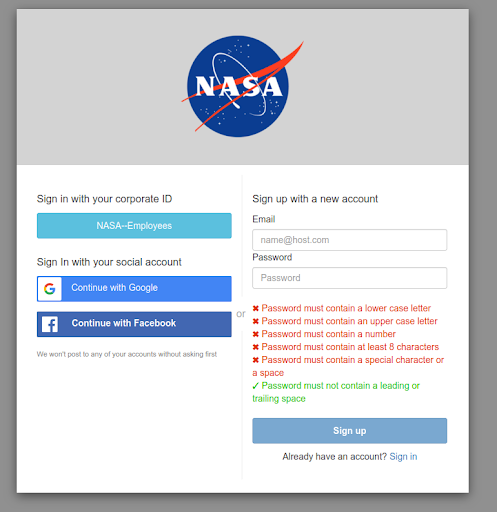
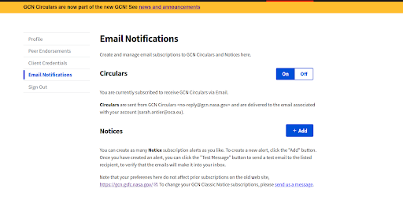

## 1.3 Getting a GCN Account

1. **Get a GCN account**: GCN (Gamma-ray Coordinates Network) is a system used by astrophysics researchers worldwide to send out updates and circulars of their observations and data findings. Like GRANDMA, other teams also perform observations, so this system keeps everyone up to date.

2. **To get an account**: 
   - Visit [GCN](https://gcn.nasa.gov/) (or for more detailed instructions, you can also check the old link: [GCN Circulars](https://gcn.gsfc.nasa.gov/gcn3_circulars.html)).
   - Sign up with a new account.

   **Note**: The process may take some time, and you need to have someone grant you permission. You can ask sarah.antier@oca.eu or any other GRANDMA member who already has access.

3. **Activate notifications**:
   - Go to your profile and turn on the circulars button to receive notifications on the circulars.

