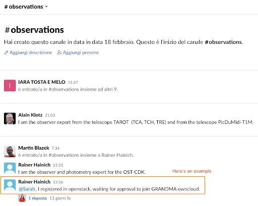

## 1.4 Connecting to GRANDMA’s Owncloud

**Connect to GRANDMA Owncloud**: Owncloud is like Google Drive for GRANDMA; it is where we will store GCNs, all the data from observations, and any analysis of the alerts through our pipelines.

Click the following link to connect to Owncloud: [GRANDMA Owncloud](https://grandma-owncloud.lal.in2p3.fr/index.php/apps/files/?dir=/Candidates/GW&fileid=1069468)

If you don’t have access, you need to create an “openstack” account. To do this, register at [Openstack Registration](https://registration.lal.in2p3.fr/) and keep your password and username.

If you have previously had an account and lost it or want to change your email address from a previous account, contact Gerard Marchal Duval at [marchal@lal.in2p3.fr](mailto:marchal@lal.in2p3.fr). Otherwise, proceed to the next step.

As soon as you complete the above steps, message in the `#grandma`, `#observations`, or `#training` channel: “@Sarah, I registered in Openstack, waiting for approval to join GRANDMA Owncloud.”

Sarah will grant you access (this may take 24 hours). You will have access to GRANDMA’s Owncloud, which you can open anytime using: [GRANDMA Owncloud Files](https://grandma-owncloud.lal.in2p3.fr/index.php/apps/files?dir=/&fileid=205286)
