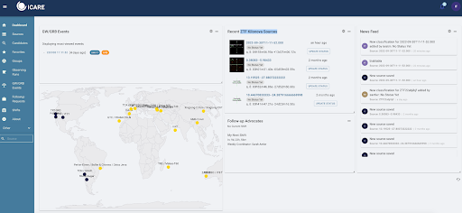
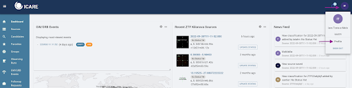
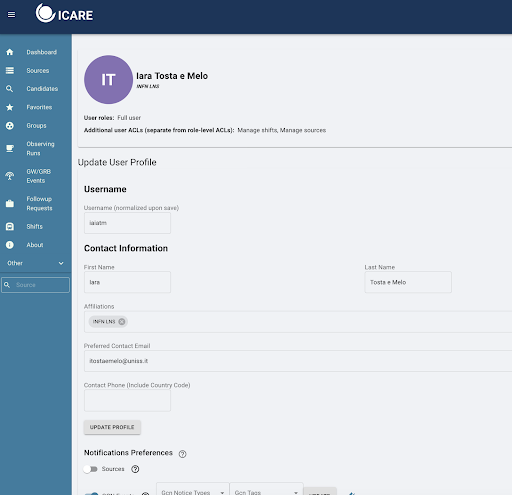
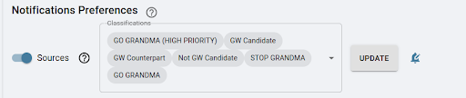
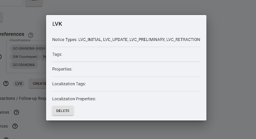
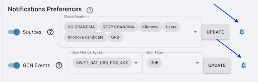
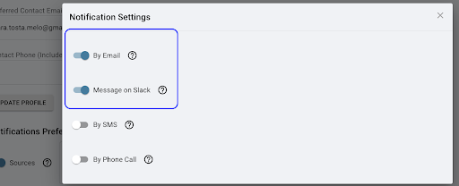

## 1.5 Connecting to ICARE Skyportal

**Joining I-Care/Skyportal**: We will use SkyPortal in our observational campaigns. This platform will be the interface we use to conduct the campaign, including receiving alerts, contacting teams, updating data, etc.

First, subscribe and access it through the link: [SkyPortal I-Care](https://skyportal-icare.ijclab.in2p3.fr/)

As soon as you connect, you will see a page like the following (if not, click on "Dashboard" on the right sidebar). Your initials should appear in the top right corner.

**Note**: If you do not see this page, make sure to click on "Dashboard".

### Setting Your Profile in SkyPortal

The next step is to activate the notifications you would like to receive. As FAs, you need to go to your profile to change your notification preferences:

1. In your profile page, ensure your email is correct as you will receive information about our campaign there.
2. On the “Notifications Preferences” page, indicate which sources you would like to receive notifications about by email. The options will vary if you are an FA, observer, or both.

#### 1.5.1 For Follow-Up Advocates:

1. When making any setting changes, press "Update" at each line where it appears.
2. Turn on the “Sources” button and select `GW CANDIDATE` and `GW COUNTERPART` from the list of options.

  
4. Click on "Update!"

   For GCN events, create `LVK` and add `LVC_INITIAL`, `LVC_UPDATE`, `LVC_PRELIMINARY`, `LVC_RETRACTION`.

   **DO NOT FORGET TO PRESS UPDATE FOR YOUR OPTIONS AND SET UP THE NOTIFICATIONS SETTINGS (BELL SYMBOL)!!!**

#### 1.5.2 For Telescope Teams (only):

1. Set as sources the options: 
   - `GO GRANDMA`
   - `STOP GRANDMA`
   - `Observation_plan`

   **DO NOT FORGET TO PRESS UPDATE!!!**

#### 1.5.3 For Follow-Up Advocates & Telescope Teams:

1. Below the “sources” section, find the “GCN Events” option. Ensure this option is turned on, and then click on “create new profile.” In this new profile, filter the event as follows:

   Your GCN Events should have: 
   - `LVC_PRELIMINARY`
   - `LVC_INITIAL`
   - `LVC_UPDATE`
   - `LVC_RETRACTION` under “GCN Notice Types”
   - `GW` under “GCN Tags”

   **DO NOT FORGET TO PRESS UPDATE FOR YOUR OPTIONS AND SET UP THE NOTIFICATIONS SETTINGS (BELL SYMBOL)!!!**

In all cases, make sure to set the options to receive alerts by email and on Slack by clicking on the “bell” symbol.

You need to turn on the options to receive alerts by email and Slack.

