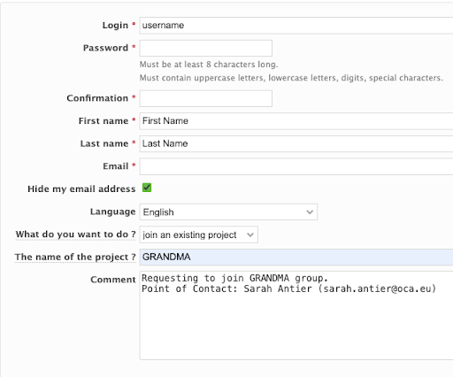

## 1.6 Getting a FORGE Account

**FORGE** is where GRANDMA’s active documents and event lists are located. This is where we store our meeting minutes, project information, and the GRANDMA email list.

1. Go to [FORGE](https://forge.in2p3.fr/).
2. Select **Register** in the upper right.
3. When you get to the following page, make sure to select **“Join an existing project”** and type in **“GRANDMA”**. Refer to Sarah Antier in the comment section.
4. Then, email or contact her through Slack to gain access.

